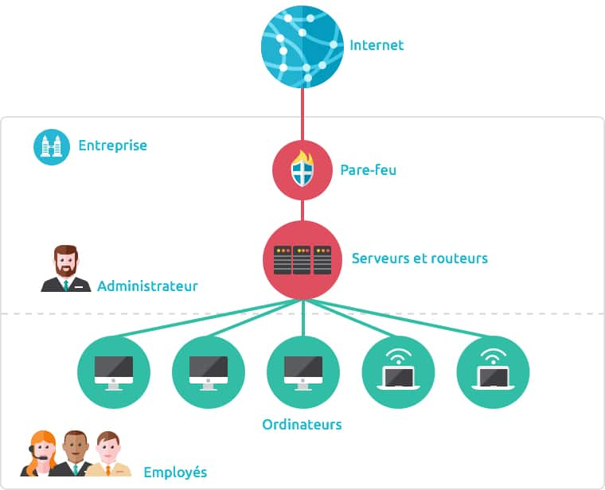
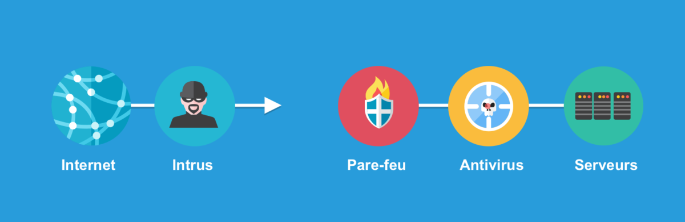
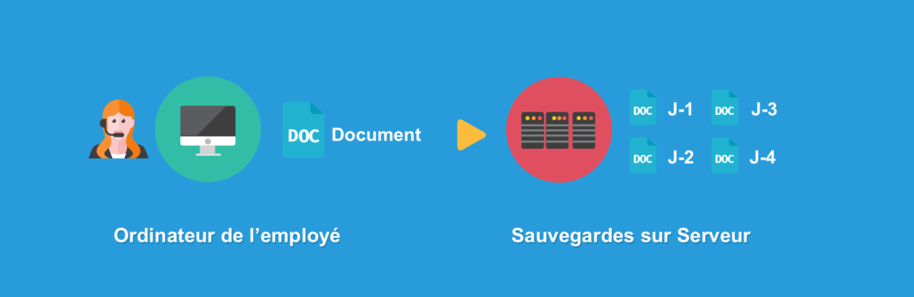
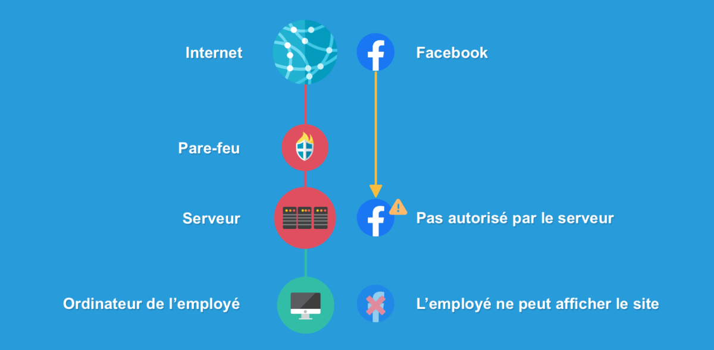
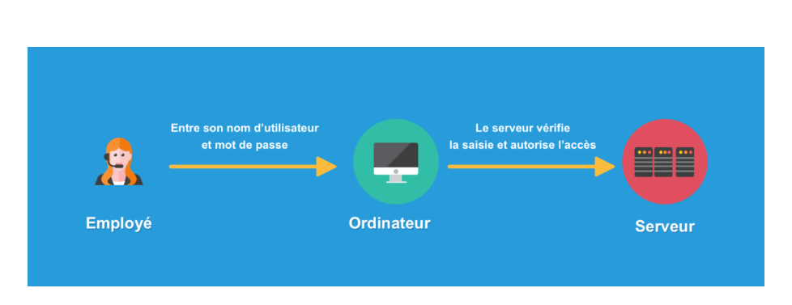
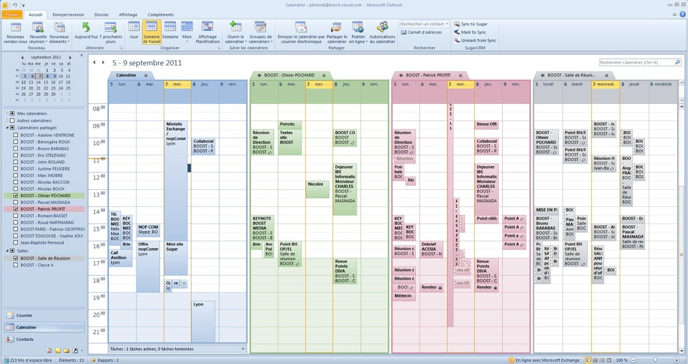
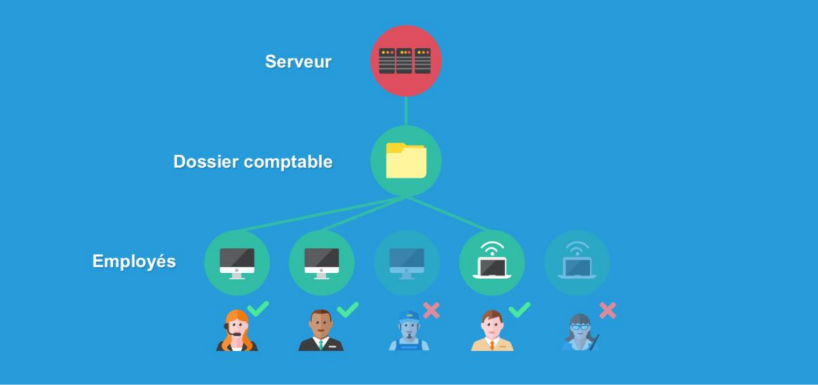
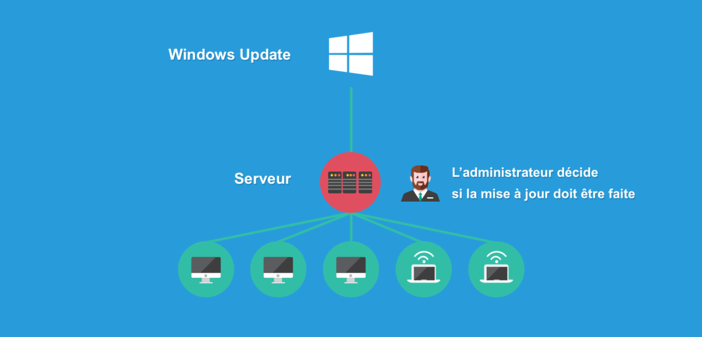
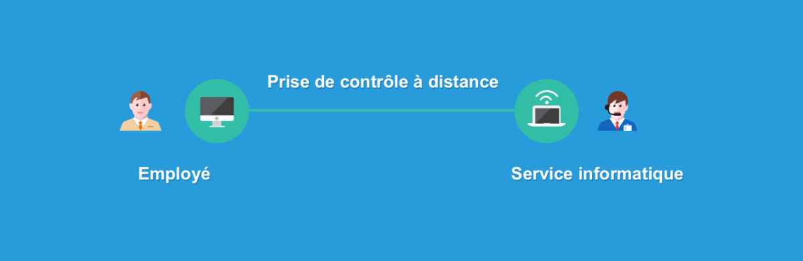

# Introduction au réseau d’entreprise

# Comment fonctionne l’informatique en entreprise
## 1. Un réseau en entreprise, pour quoi faire ?
### Réseau d’entreprise
#### Définition

Le réseau d’entreprise permet de relier chaque ordinateur entre eux via un serveur qui va gérer l’accès à Internet, les e-mails, les droits d’accès aux documents partagés et le travail collaboratif. Chaque utilisateur du réseau se connecte avec un nom d’utilisateur et un mot de passe et est authentifié par le serveur. L’utilisateur peut accéder à ses données et au partage de fichiers.

Le réseau en entreprise permet à l’entreprise de centraliser ses données, les sécuriser et de travailler en équipe de manière productive. Dans ce cours je vais vous présenter le schéma type d’un réseau d’entreprise et ses différents rôles.

## 2. Schéma type d’un réseau d’entreprise
Dans une entreprise, il existe une hiérarchie au niveau des employés. C’est la même chose au niveau des ordinateurs : l’un des ordinateurs va jouer le rôle du patron, on l’appelle le serveur d’entreprise. C’est une machine plus puissante que les autres et qui a beaucoup de responsabilités. Ce serveur est géré par le service des systèmes d’information (SSI) ou service informatique. La personne en charge de ce serveur est l’administrateur et il est le seul à avoir accès à la salle des serveurs.

---

# Les rôles du serveur et du réseau d’entreprise

## Serveur
### Définition

Le serveur en entreprise est un ordinateur plus puissant qui va s’occuper du partage des fichiers, de faire des sauvegardes des données régulièrement, d’autoriser ou non l’accès à un ordinateur au réseau d’entreprise, gérer les e-mails, la connexion Internet et la sécurité informatique. Les serveurs sont souvent stockés dans une pièce dédiée et ventilée, dont l’accès est restreint à l’administrateur. On peut considérer le serveur comme le patron des ordinateurs de l’entreprise.

Vous l’aurez compris, le serveur a un rôle essentiel dans le réseau d’entreprise, que ce soit pour le partage, la communication, la sécurité et la productivité. Nous allons voir quels sont les rôles que peut jouer un serveur en entreprise.

---

#### 3.1 Rôle de sécurité
Parce que les données d’une entreprise sont privées et ne doivent pas tomber à la portée de tous, le serveur doit protéger l’entreprise des intrusions extérieures via Internet. Il ne laisse pas n’importe qui accéder au réseau, seules les personnes autorisées peuvent le faire. Le serveur est équipé d’un pare-feu qui repousse les intrusions et d’un antivirus qui permet de se prémunir contre les attaques venant d’Internet.

---

#### 3.2 Rôle de protection des données et sauvegardes

Le serveur joue également un rôle crucial dans la protection des données et la réalisation de sauvegardes régulières au sein de l'entreprise. En assurant une sauvegarde continue des données générées, il permet de pallier les erreurs humaines telles que la suppression accidentelle de fichiers ou les dysfonctionnements informatiques. 

Grâce à ses fonctionnalités de sauvegarde, le serveur est capable de restaurer les fichiers perdus, offrant ainsi une assurance contre la perte de données critiques. Parfois, les documents sont sauvegardés en plusieurs exemplaires et à différentes dates, ce qui permet de récupérer des versions antérieures des fichiers, même plusieurs jours en arrière, en cas de besoin. Cette pratique garantit une sécurité supplémentaire et une réduction du risque de perte de données importante pour l'entreprise.

---

#### 3.3 Gestion de la connexion à Internet et filtrage des sites

Le serveur assume un rôle central dans la gestion de la connexion à Internet au sein de l'entreprise. Il est chargé de recevoir et de réguler la distribution de cette connexion aux employés en fonction de leurs autorisations définies. De plus, le serveur exerce souvent une fonction de filtrage des sites web, permettant de restreindre l'accès à certains sites pendant les heures de travail. Cette mesure vise à garantir que les employés utilisent la connexion Internet de manière appropriée et productive, tout en préservant la sécurité du réseau et en évitant les distractions potentielles. En fournissant un contrôle précis sur l'accès à Internet, le serveur contribue à maintenir un environnement de travail efficace et sécurisé au sein de l'entreprise.

---

#### 3.4 Gestion des utilisateurs et autorisations d’accès au réseau

Chaque employé possède un compte sur son ordinateur sécurisé par un mot de passe (les identifiants vous sont communiqués à votre arrivée dans l’entreprise par le service informatique). Lorsque l’ordinateur s’allume, le nom d’utilisateur et le mot de passe sont demandés par le serveur. C’est lui qui s’occupe d’authentifier l’utilisateur et de lui autoriser l’accès à son poste de travail.

Cette méthode garantit que seuls les utilisateurs autorisés peuvent accéder aux ressources de l'entreprise, renforçant ainsi la sécurité du réseau. De plus, elle permet de tracer les activités des utilisateurs et de contrôler leur accès aux données sensibles, contribuant ainsi à prévenir les violations de sécurité et à assurer la conformité aux politiques de sécurité de l'entreprise.

---

#### 3.5 Gestion des mails, des agendas partagés, des contacts partagés

La gestion des mails, des agendas partagés et des contacts partagés est une fonctionnalité importante du serveur dans un environnement professionnel. Le serveur assume la responsabilité de recevoir et d'envoyer des courriels pour les utilisateurs de l'entreprise, tout en fournissant également un filtrage anti-spam pour réduire le volume de courrier indésirable.

En outre, le serveur peut être configuré pour gérer les agendas individuels des employés, ainsi que des agendas partagés pour faciliter la planification des réunions et des événements d'équipe. Ceci est particulièrement utile pour coordonner les activités au sein de l'entreprise et garantir une meilleure efficacité dans la gestion du temps.

De plus, la centralisation des contacts au niveau du serveur permet à chaque employé d'avoir accès à un carnet d'adresses complet de l'entreprise, facilitant ainsi la communication interne et externe.

L'utilisation d'outils tels qu'Outlook avec Exchange permet de mettre en place des fonctionnalités avancées telles que la gestion d'agenda partagé, simplifiant ainsi la coordination des équipes et l'organisation des tâches au sein de l'entreprise. Cette intégration contribue à accroître la productivité et l'efficacité de l'ensemble de l'entreprise.

---

#### 3.6 Partage de ressources, documents et amélioration de la productivité

La mise en place de dossiers partagés par le serveur constitue une stratégie clé pour le partage de ressources et de documents au sein de l'entreprise, ce qui améliore significativement la productivité des équipes. Ces dossiers sont accessibles de manière sélective, selon les besoins et les responsabilités de chaque employé.

Par exemple, le service de comptabilité peut bénéficier de dossiers partagés pour collaborer sur des résultats financiers, des tableaux de calculs et d'autres documents nécessaires à leur travail quotidien. Ces dossiers sont uniquement accessibles aux membres du service de comptabilité et à la direction, garantissant ainsi la confidentialité des informations sensibles.

Cette approche facilite la collaboration entre les membres d'une équipe et favorise un partage efficace des connaissances et des ressources. De plus, en centralisant les documents dans des dossiers partagés, le serveur contribue à organiser l'information de manière structurée, ce qui permet aux employés de trouver rapidement les données dont ils ont besoin pour accomplir leurs tâches. En fin de compte, cette gestion efficace des ressources et des documents conduit à une amélioration globale de la productivité au sein de l'entreprise.

---

#### 3.7 Installation de logiciels et mise à jour du parc informatique

L'installation de logiciels et la mise à jour du parc informatique sont des processus essentiels pour maintenir la sécurité et la performance des systèmes informatiques en entreprise. Dans ce contexte, le serveur joue un rôle central en coordonnant ces opérations.

Un exemple frappant est la distribution automatique des mises à jour de Windows via Windows Update. Ces mises à jour, qui sont essentielles pour corriger les failles de sécurité et les bugs, sont distribuées mensuellement aux ordinateurs du réseau. Cependant, en entreprise, c'est le serveur qui reçoit ces mises à jour et les redistribue ensuite aux ordinateurs connectés au réseau.

L'administrateur système est chargé de sélectionner les mises à jour à appliquer, en tenant compte notamment de la compatibilité avec les logiciels professionnels utilisés par l'entreprise. Si une mise à jour risque de rendre incompatible un logiciel crucial pour l'activité de l'entreprise, elle peut être différée ou refusée.

Cette approche permet de maintenir un environnement informatique sécurisé et performant en entreprise, tout en minimisant les risques liés aux mises à jour logicielles. En centralisant la gestion des mises à jour au niveau du serveur, l'entreprise peut assurer une cohérence et une efficacité dans la maintenance de son parc informatique.

---

#### 3.8 Assistance à distance

L'assistance à distance est un processus clé pour résoudre les problèmes informatiques des employés de manière efficace et rapide. Lorsqu'un employé rencontre un problème informatique, il contacte le service des systèmes d'information de l'entreprise.

Un technicien ou un spécialiste en informatique prend alors le contrôle de l'ordinateur à distance, grâce à des outils de prise en main à distance. Cette prise en main à distance permet au technicien de diagnostiquer et de résoudre le problème sans que l'employé ait besoin de se déplacer physiquement. Cela permet non seulement de gagner du temps, mais aussi d'économiser des ressources en évitant les déplacements inutiles.

Ce processus d'assistance à distance est particulièrement efficace pour résoudre les problèmes mineurs ou courants, tels que des erreurs logicielles ou des configurations incorrectes. Il permet également d'offrir un support technique rapide et réactif aux employés, contribuant ainsi à maintenir la productivité et la continuité des opérations au sein de l'entreprise.

---

