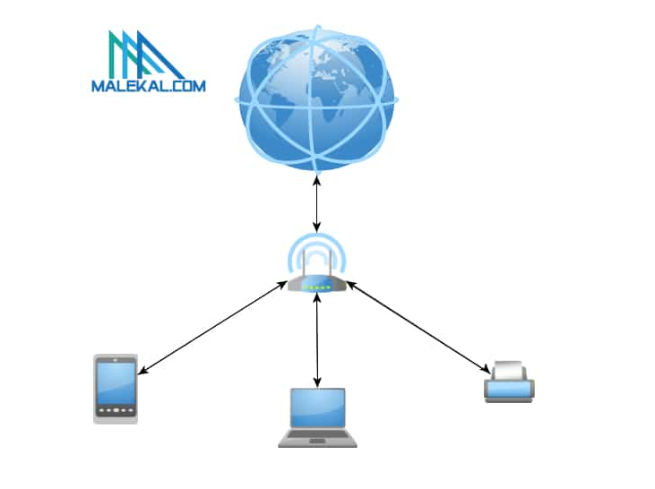
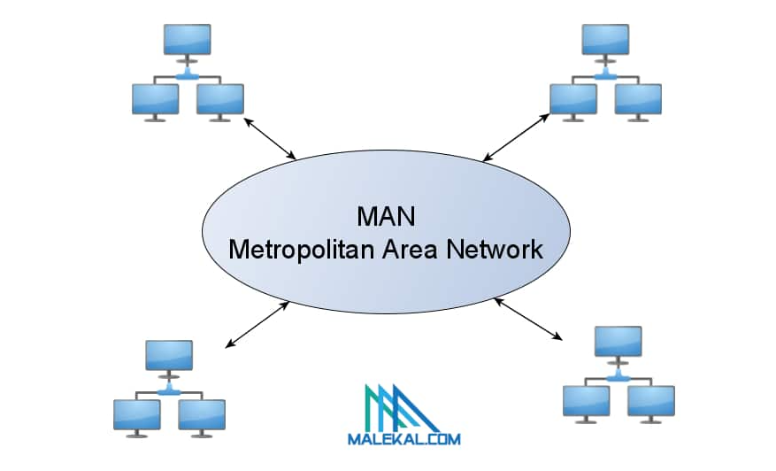
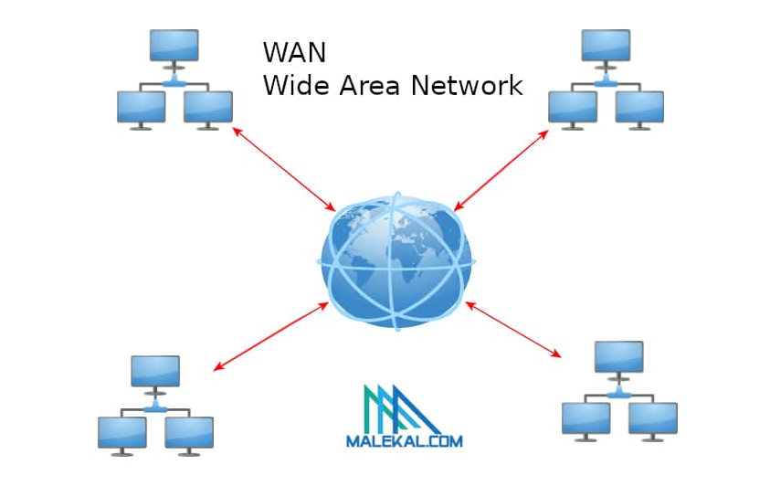
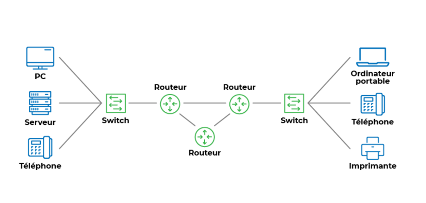

# **Découverte de l'Organisation d'un Réseau**

# **Appréhendez la Notion de Réseau**

Dans notre utilisation quotidienne d'applications et de services numériques tels que la navigation sur Internet, la consultation des e-mails ou l'interaction sur les réseaux sociaux, nous sommes souvent peu conscients des réseaux informatiques qui sous-tendent ces activités. Un réseau informatique est un système de communication qui permet à des appareils informatiques de se connecter entre eux pour partager des ressources et des données. Il existe différents types de réseaux, du réseau local (LAN) qui relie des appareils dans un même lieu physique, au réseau étendu (WAN) qui relie des appareils sur de longues distances géographiques.

Le fonctionnement des réseaux informatiques repose sur des protocoles et des normes de communication, tels que le protocole TCP/IP utilisé sur Internet. Les données sont transférées à travers le réseau sous forme de paquets, qui contiennent des informations sur leur destination, leur origine et leur contenu. Ces paquets sont routés à travers le réseau par des dispositifs tels que les routeurs et les commutateurs, qui déterminent le chemin le plus efficace pour les atteindre.

Comprendre la notion de réseau informatique est essentiel dans notre société numérique, car elle nous permet de mieux appréhender le fonctionnement des services et des technologies que nous utilisons au quotidien. Cela nous aide également à comprendre les enjeux liés à la sécurité, à la confidentialité et à la performance des réseaux, ainsi qu'à apprécier l'importance de maintenir et de développer des infrastructures réseau robustes et fiables.

---

# **Qu'est-ce qu'un Réseau ?**

Un réseau informatique permet l'interconnexion d'une multitude de machines entre elles pour faciliter la transmission d'informations. Cette infrastructure complexe supporte les échanges de données sur de courtes à très longues distances, grâce à une série d'étapes impliquant la conversion, l'amplification, le chiffrement et l'atténuation des signaux.

---

# **L'Évolution des Réseaux**

Les réseaux ont radicalement évolué depuis l'époque où la seule forme de transmission de données entre ordinateurs était physique, via des disquettes. Aujourd'hui, nous bénéficions d'Internet, un réseau mondial composé de millions de réseaux plus petits.

---

# **Types de Réseaux Informatiques**

Les réseaux informatiques se classent généralement en trois catégories principales en fonction de leur
échelle géographique.

---

## **LAN (Local Area Network)**

- Les **LAN** son des réseaux à l'échelle locale, tels que les réseaux domestiques ou ceux d'une entreprise.
- Ils permettent la connecxion d'ordinateurs et d'autres dispositifs au sein d'un espace géographique limité, comme un bâtiment ou un campus.

---

## **MAN (Metropolitan Area Network)**

- Les **MAN** couvrent une zone géographiqueplus étendue, comme une ville,interconnectant plusieurs **LANs**.
- Un exemple typique est le réseau universitaire qui relie différentes facultés d'une même ville.

---

## **WAN (Wide Area Network)**

- Les **WAN** englobent des réseaux à l'échelle nationale ou mondiale, avec Internet étant le plus grand et le plus connu des **WANs**.
- Internet connect des millards de dispositif à travers le monde, intrégrant à la fois des **MANs** et des **LANs**

---

# **Éléments Physique d'un Réseau Informatique**

# **Schéma Logique de Réseau**
- Le schéma logique offre une représentation de l'architecture d'un réseau, détaillant les composants physiques et certains aspects de sa configuration logicielle.
- C'est un outil essentiel pour les techniciens informatiques, car il permet de comprendre, créer et configurer des réseaux.

---

# **Composants d'un Réseau**

Les réseaux informatiques se composent de plusieurs éléments essentiels pour faciliter la communication et l'échange de données.

1. **Équipements Terminaux (en bleu) :** Ce sont les dispositifs aux extrémités du réseau qui ont besoin d'échanger des données. Les équipements terminaux incluent les PC, téléphones, serveurs et imprimantes.

2. **Équipements d'Interconnexion (en vert) :** Situés au cœur du réseau, ces équipements, tels que les switchs et routeurs, relient les équipements terminaux entre eux, facilitant ainsi la communication et le partage de ressources.

3. **Supports de Communication :** Les liaisons physiques entre les équipements, généralement sous forme de câbles, constituent les supports de communication. Ils permettent la transmission de données d'un point à un autre du réseau.

---

## **Analogie avec un Réseau Routier**

Pour mieux comprendre l'organisation d'un réseau informatique, on peut le comparer à un réseau routier :
- **Équipements Terminaux :** Votre domicile et votre bureau correspondent aux équipements terminaux dans le réseau informatique, points de départ et d'arrivée des données.
- **Équipements d'Interconnexion :** Les intersections, carrefours et ronds-points jouent le même rôle que les switchs et routeurs, en dirigeant le trafic.
- **Supports de Communication :** Les routes et autoroutes sont analogues aux câbles du réseau, canaux par lesquels le trafic (données) circule.

Cette analogie aide à visualiser le fonctionnement d'un réseau informatique et son organisation, en soulignant l'importance de chaque composant dans la transmission et la gestion des données.

---

## **Conclusion**

Comprendre les éléments physiques d'un réseau et leur organisation est fondamental pour les professionnels IT. Cela permet non seulement de configurer et de maintenir des réseaux efficacement mais aussi d'identifier et de résoudre les problèmes qui peuvent survenir dans l'infrastructure réseau.

---
