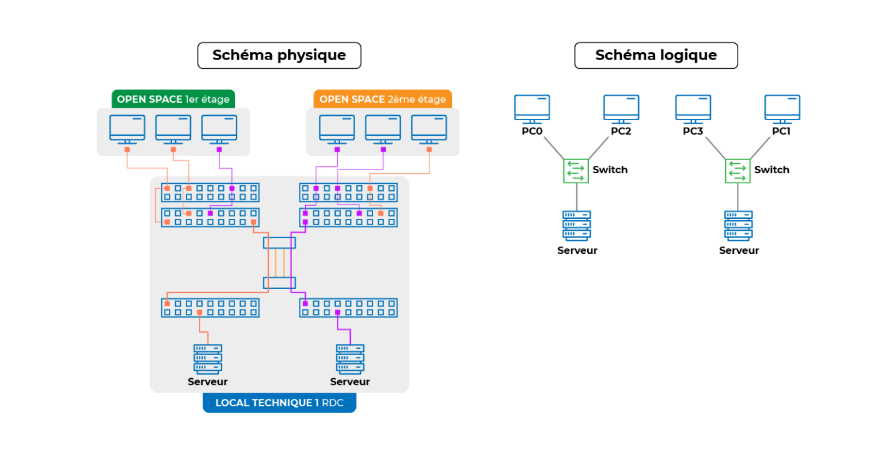
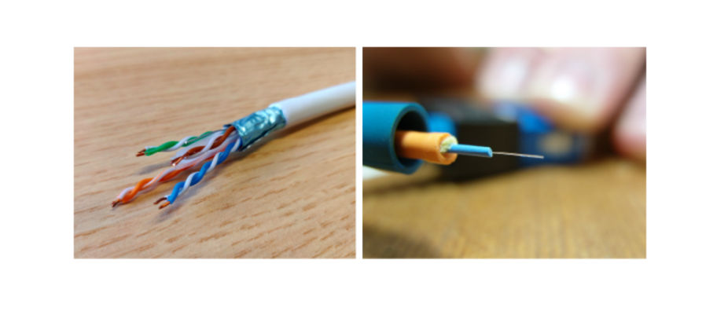
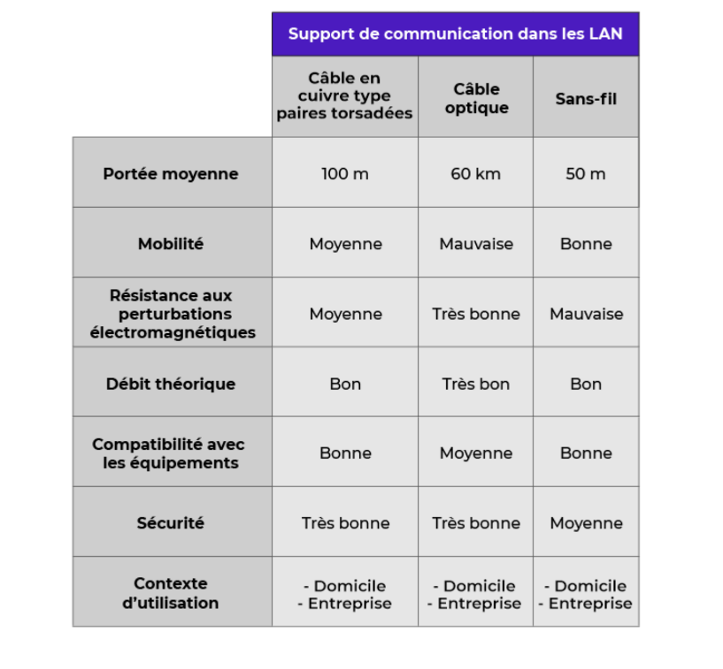

# **Découverte de l'Organisation d'un Réseau**

# **Appréhendez la Notion de Réseau**

Dans notre utilisation quotidienne d'applications et de services numériques tels que la navigation sur Internet, la consultation des e-mails ou l'interaction sur les réseaux sociaux, nous sommes souvent peu conscients des réseaux informatiques qui sous-tendent ces activités. Un réseau informatique est un système de communication qui permet à des appareils informatiques de se connecter entre eux pour partager des ressources et des données. Il existe différents types de réseaux, du réseau local (LAN) qui relie des appareils dans un même lieu physique, au réseau étendu (WAN) qui relie des appareils sur de longues distances géographiques.

Le fonctionnement des réseaux informatiques repose sur des protocoles et des normes de communication, tels que le protocole TCP/IP utilisé sur Internet. Les données sont transférées à travers le réseau sous forme de paquets, qui contiennent des informations sur leur destination, leur origine et leur contenu. Ces paquets sont routés à travers le réseau par des dispositifs tels que les routeurs et les commutateurs, qui déterminent le chemin le plus efficace pour les atteindre.

Comprendre la notion de réseau informatique est essentiel dans notre société numérique, car elle nous permet de mieux appréhender le fonctionnement des services et des technologies que nous utilisons au quotidien. Cela nous aide également à comprendre les enjeux liés à la sécurité, à la confidentialité et à la performance des réseaux, ainsi qu'à apprécier l'importance de maintenir et de développer des infrastructures réseau robustes et fiables.

---

# **Qu'est-ce qu'un Réseau ?**

Un réseau informatique permet l'interconnexion d'une multitude de machines entre elles pour faciliter la transmission d'informations. Cette infrastructure complexe supporte les échanges de données sur de courtes à très longues distances, grâce à une série d'étapes impliquant la conversion, l'amplification, le chiffrement et l'atténuation des signaux.

---

# **L'Évolution des Réseaux**

Les réseaux ont radicalement évolué depuis l'époque où la seule forme de transmission de données entre ordinateurs était physique, via des disquettes. Aujourd'hui, nous bénéficions d'Internet, un réseau mondial composé de millions de réseaux plus petits.

---

# **Types de Réseaux Informatiques**

Les réseaux informatiques se classent généralement en trois catégories principales en fonction de leur
échelle géographique.

---

## **LAN (Local Area Network)**

- Les **LAN** son des réseaux à l'échelle locale, tels que les réseaux domestiques ou ceux d'une entreprise.
- Ils permettent la connecxion d'ordinateurs et d'autres dispositifs au sein d'un espace géographique limité, comme un bâtiment ou un campus.

---

## **MAN (Metropolitan Area Network)**

- Les **MAN** couvrent une zone géographiqueplus étendue, comme une ville,interconnectant plusieurs **LANs**.
- Un exemple typique est le réseau universitaire qui relie différentes facultés d'une même ville.

---

## **WAN (Wide Area Network)**

- Les **WAN** englobent des réseaux à l'échelle nationale ou mondiale, avec Internet étant le plus grand et le plus connu des **WANs**.
- Internet connect des millards de dispositif à travers le monde, intrégrant à la fois des **MANs** et des **LANs**

---

# **Éléments Physique d'un Réseau Informatique**

# **Schéma Logique de Réseau**
- Le schéma logique offre une représentation de l'architecture d'un réseau, détaillant les composants physiques et certains aspects de sa configuration logicielle.
- C'est un outil essentiel pour les techniciens informatiques, car il permet de comprendre, créer et configurer des réseaux.

---

# **Composants d'un Réseau**

Les réseaux informatiques se composent de plusieurs éléments essentiels pour faciliter la communication et l'échange de données.

1. **Équipements Terminaux (en bleu) :** Ce sont les dispositifs aux extrémités du réseau qui ont besoin d'échanger des données. Les équipements terminaux incluent les PC, téléphones, serveurs et imprimantes.

2. **Équipements d'Interconnexion (en vert) :** Situés au cœur du réseau, ces équipements, tels que les switchs et routeurs, relient les équipements terminaux entre eux, facilitant ainsi la communication et le partage de ressources.

3. **Supports de Communication :** Les liaisons physiques entre les équipements, généralement sous forme de câbles, constituent les supports de communication. Ils permettent la transmission de données d'un point à un autre du réseau.

---

## **Analogie avec un Réseau Routier**

Pour mieux comprendre l'organisation d'un réseau informatique, on peut le comparer à un réseau routier :
- **Équipements Terminaux :** Votre domicile et votre bureau correspondent aux équipements terminaux dans le réseau informatique, points de départ et d'arrivée des données.
- **Équipements d'Interconnexion :** Les intersections, carrefours et ronds-points jouent le même rôle que les switchs et routeurs, en dirigeant le trafic.
- **Supports de Communication :** Les routes et autoroutes sont analogues aux câbles du réseau, canaux par lesquels le trafic (données) circule.

Cette analogie aide à visualiser le fonctionnement d'un réseau informatique et son organisation, en soulignant l'importance de chaque composant dans la transmission et la gestion des données.

---

## **Conclusion**

Comprendre les éléments physiques d'un réseau et leur organisation est fondamental pour les professionnels IT. Cela permet non seulement de configurer et de maintenir des réseaux efficacement mais aussi d'identifier et de résoudre les problèmes qui peuvent survenir dans l'infrastructure réseau.

---

# **Distinction entre Schéma Logique et Schéma Physique**

Dans le domaine de la technologie de l'information, deux types de schémas sont couramment utilisés pour la conception, la modélisation et le déploiement des réseaux informatiques : le schéma logique et le schéma physique. Chacun de ces schémas remplit des objectifs spécifiques et fournit des informations distinctes.
**

---

## **Schéma Logique**

- **Objectif :** Utilisé pour la conception, la modélisation et la configuration du réseau. Il aide à comprendre l'architecture et la configuration logicielle du réseau.
- **Caractéristiques :** Montre l'organisation et les connexions des différents éléments du réseau, tels que les équipements terminaux, les équipements d'interconnexion et les supports de communication.

---

## **Schéma Physique**

- **Objectif :** Utilisé pour le déploiement physique du réseau, y compris l'installation et le câblage du matériel. Il fournit une vue détaillée de l'emplacement physique et de la connexion des composants du réseau.
- **Caractéristiques :** Indique la localisation exacte des équipements dans un environnement physique, décrit les détails de connexion comme le nombre de câbles utilisés et les types de connexions entre les équipements, et précise le nombre total de dispositifs connectés au réseau.

---

**Comparaison et Complémentarité**

- **Représentation :** Les schémas logiques et physiques offrent une perspective différente sur le réseau. Le schéma logique se concentre sur l'organisation conceptuelle et les connexions logiques, tandis que le schéma physique fournit une vue concrète et détaillée de l'infrastructure matérielle du réseau.

En résumé, le schéma logique permet de conceptualiser et de configurer le réseau, tandis que le schéma physique décrit sa mise en œuvre concrète et physique. Ils se complètent pour offrir une compréhension complète de l'architecture et du fonctionnement du réseau informatique.

---
# **Identification des Émetteurs-Récepteurs dans un Réseau**

# **Types de Machines dans un Réseau**

Dans un réseau informatique, on trouve divers types de machines qui remplissent des fonctions spécifiques et qui contribuent à la communication et au partage d'informations. Voici un aperçu des principaux types de machines :

1. **Ordinateurs, tablettes, smartphones :** Ces appareils sont utilisés au quotidien pour accéder à des informations et communiquer, que ce soit pour le travail, les études ou les loisirs.

2. **Serveurs :** Ils jouent un rôle crucial dans le stockage, l'hébergement et la consultation d'informations. Les serveurs peuvent être spécialisés dans différents domaines, tels que le stockage de données, le partage de fichiers ou l'hébergement de sites web.

3. **Téléphones fixes :** Autrefois utilisés uniquement pour les appels vocaux, les téléphones fixes sont devenus des terminaux numériques, similaires aux ordinateurs, capables de se connecter au réseau pour accéder à des services en ligne.

4. **Imprimantes et photocopieuses :** Ces périphériques de sortie sont connectés au réseau pour permettre l'impression et la numérisation de documents, facilitant ainsi le partage d'informations entre les utilisateurs.

5. **Objets connectés :** Des appareils tels que les réfrigérateurs, les fours, les voitures et autres intègrent désormais une connectivité réseau, leur permettant de communiquer et d'échanger des données avec d'autres appareils et systèmes.

**Point Commun : Le Langage Binaire**

Toutes ces machines communiquent en utilisant le langage binaire, composé uniquement de "0" et de "1". Ce système de numérotation est à la base de la communication numérique entre les machines. Les messages humains, tels que la voix, les images, les vidéos ou le texte, sont convertis en messages numériques (langage binaire) par les machines pour permettre leur traitement et leur transmission dans le réseau.

Cette variété de machines et leur capacité à communiquer via le langage binaire sont essentielles pour assurer le bon fonctionnement et la connectivité d'un réseau informatique, facilitant ainsi le partage d'informations et la collaboration entre utilisateurs.

---

# **Processus de Conversion et Transmission**

1. **Numérisation du Message** : Le message humain est d'abord converti en format numérique,
permettant sa manipulation par la machine.
2. **Transmission du Message** : Le message numérisé est ensuite transféré vers une autre machine
via un support de communication, en fonction de l’usage prévu (échange de données, commande
d'action, etc.).
Le langage binaire et la capacité à traiter et transmettre des informations numériques constituent le
fondement de la communication dans les réseaux informatiques. Comprendre ces principes est
essentiel pour créer, configurer et gérer efficacement un réseau. Les supports de communication jouent
également un rôle crucial en reliant ces machines entre elles, permettant ainsi l'échange d'informations
à travers le réseau.

---

# **Détermination du Support de Communication Adapté**

## **Types de Supports de Communication**

1. **Câble en Cuivre (Paires Torsadées)**
Communément appelé câble réseau, câble Ethernet, ou câble RJ45, bien que ces termes ne
soient pas totalement précis. C'est le support le plus fréquemment utilisé pour la connexion de
PC, serveurs, téléphones, etc.
2. **Câble Optique (Fibre Optique)**

Utilisé pour des connexions à longue distance ou dans des environnements sujets à des
perturbations électromagnétiques. Offre de hauts débits et une bonne sécurité mais est plus
coûteux et fragile comparé au câble en cuivre.
3. **L’Air (Communication Sans Fil)**
Choix privilégié pour offrir de la mobilité aux usagers, dans les universités par exemple. Moins
sécurisé que les connexions filaires.

---

# **Critères de Choix**

- **Votre choix de support de communication doit être basé sur plusieurs paramètres** :

- **Type d’Équipement à Raccorder** : Différents équipements peuvent avoir des besoins spécifiques
en termes de connectivité.

- **Distance entre les Équipements** : La distance maximale supportée varie selon le type de câble.

- **Environnement Extérieur** : Les conditions environnementales comme la perturbation
électromagnétique peuvent influencer le choix.

- **Usage** : Les besoins en termes de mobilité des usagers et les débits nécessaires sont également à
prendre en compte.

---

