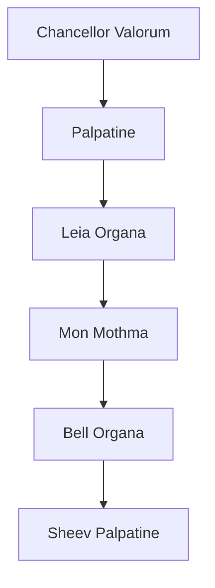

# Titre 1
## Tritre 2
### Tritre 3
#### Tritre 4
**texte en gras**

texte non en gras


```powershell
print("texte alternatif")
```

---

-

*

`voici du code non spécifié`

<image src="./Images/S0-salon-de-geneve-2017-ferrari-812-superfast-toujours-plus-396271.jpg" style="display:block; width:20vw;">


---


