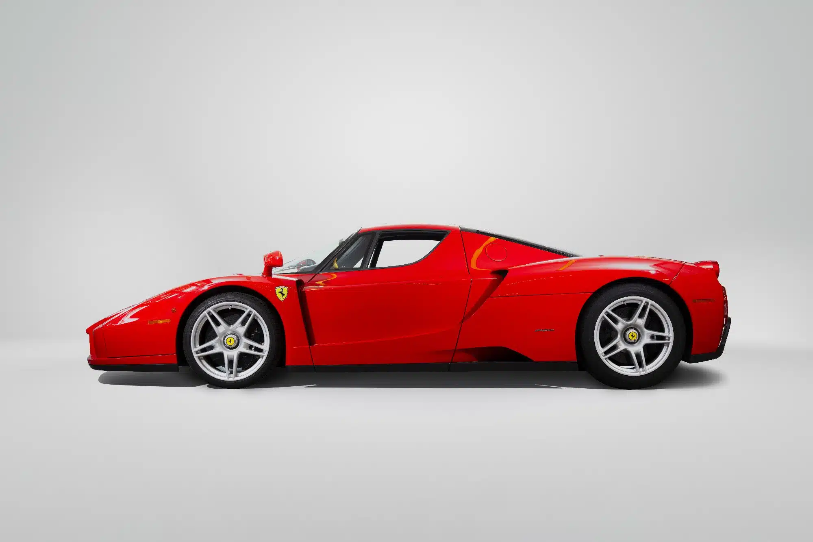

# Titre 1
## Tritre 2
### Tritre 3
#### Tritre 4
**texte en gras**

texte non en gras



```powershell
print("texte alternatif")
```

---

-

*

`voici du code non spécifié`

<image src="./Images/S0-salon-de-geneve-2017-ferrari-812-superfast-toujours-plus-396271.jpg" style="display:block; width:20vw;">


---


```mermaid
journey
    title Croissance du chiffre d'affaires de Ferrari
    section Croissance
        note right of Croissance: Ferrari a été fondée en 1939.
        Croissance(Fondation) --> |Début| 1950
        Croissance(1950) --> |Croissance régulière| 1960
        Croissance(1960) --> |Expansion internationale| 1970
        Croissance(1970) --> |Innovation technologique| 1980
        Croissance(1980) --> |Croissance continue| 1990
        Croissance(1990) --> |Introduction en bourse| 2000
        Croissance(2000) --> |Diversification des produits| 2010
        Croissance(2010) --> |Expansion des marchés émergents| 2020
        Croissance(2020) --> |Innovation électrique| 2024
        Croissance(2024) --> |Projection future| Futur
    section Futur
        note right of Futur: La croissance future est sujette à des prévisions et des changements de l'industrie.
```