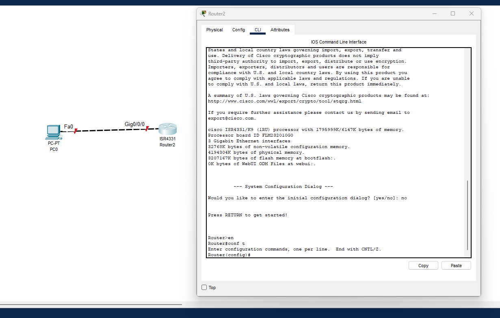
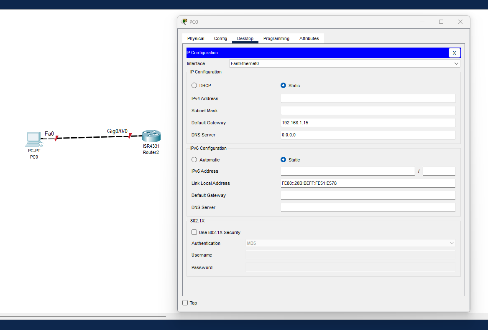
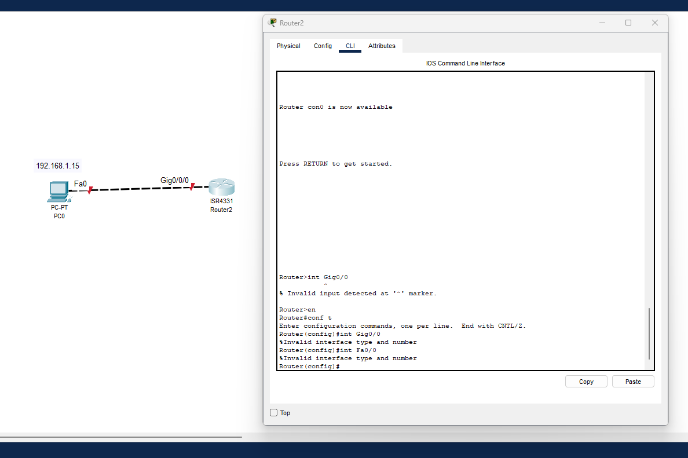
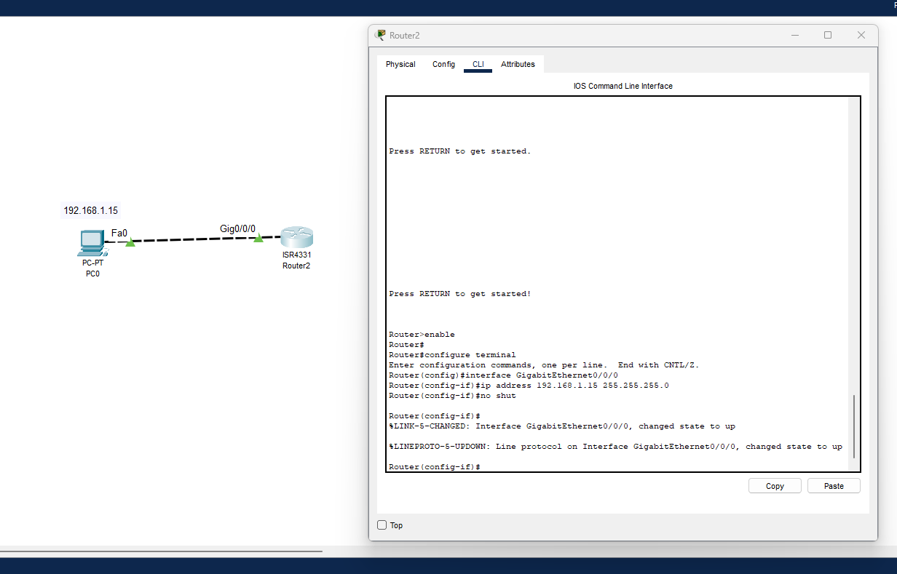
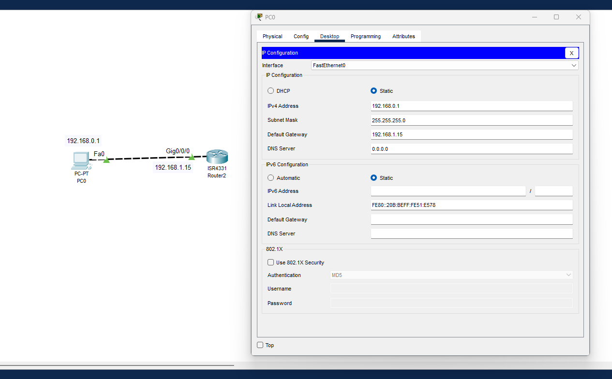

# TP prise-en-main Christopher Martin

1. **Configuration Initiale**

    ` no # appuyer sur entrer `

    ` Enable ou en `

    ` interface gigabitEthernet 0/0/0 ou int Gig0/0 `

    ` ip address 192.168.1.15 255.255.255.0 `

    ` No shutdown ou no shut `

    ` username Utilisateur 0 15 `

  

2. **Gestion des Accès**

    ` Enable pour être en mode privilégier `

    ` username Utilisateur 0 15 `

    ` password motdepasse secret `

    ` switchport mode access `

    ` switchport access vlan 20 `

    ` line cosole 0 `

  

3. **Configuration des Interfaces**

    ` en `

    ` conf t `

    ` vlan 30 `

    ` name Voix `

    ` exit `

    ` int Gig0/2 `

    ` switchport mode access `

    ` switchport access vlan 30 `

  

4. **Sauvegarde et Gestion des Configurations**

    ` copy running-config tftp `

    ` copy tftp running-config `

