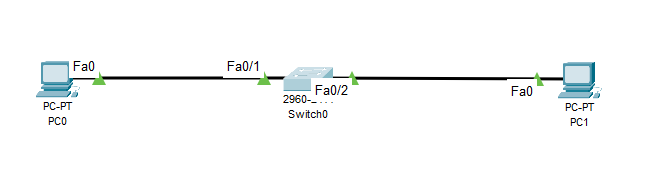
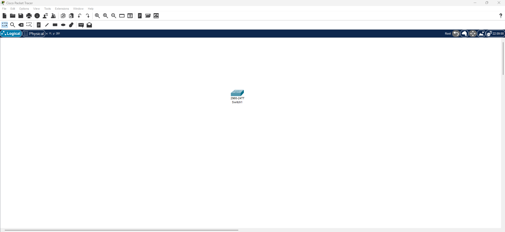
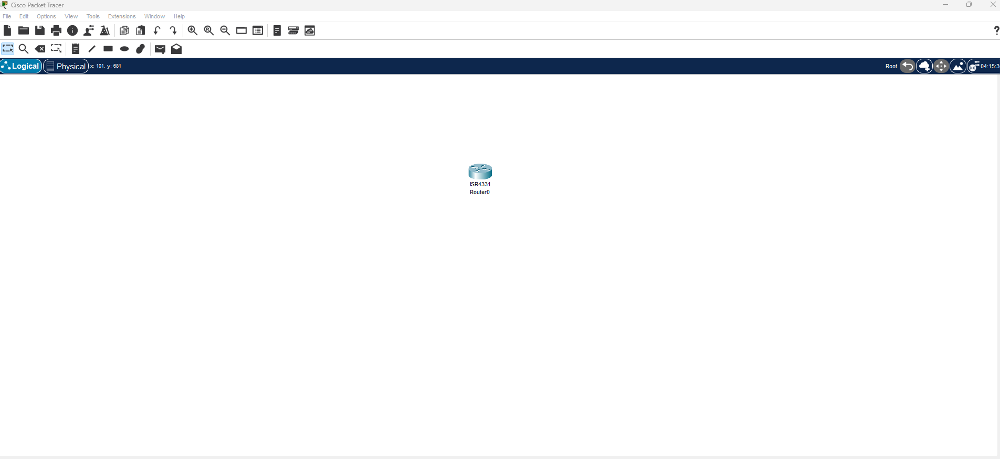
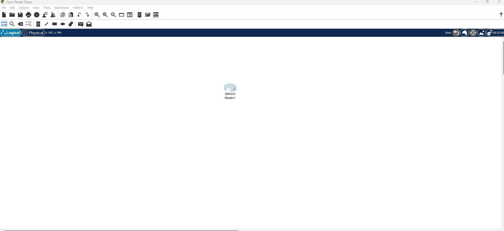
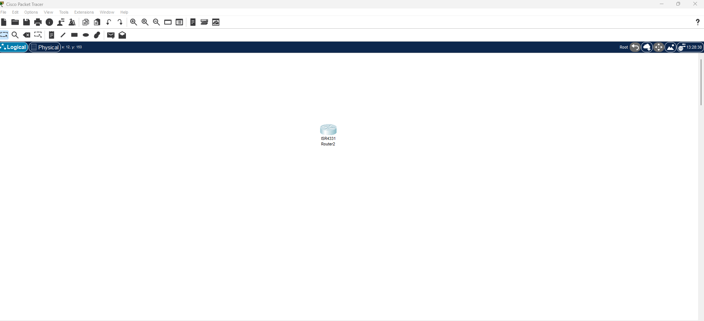
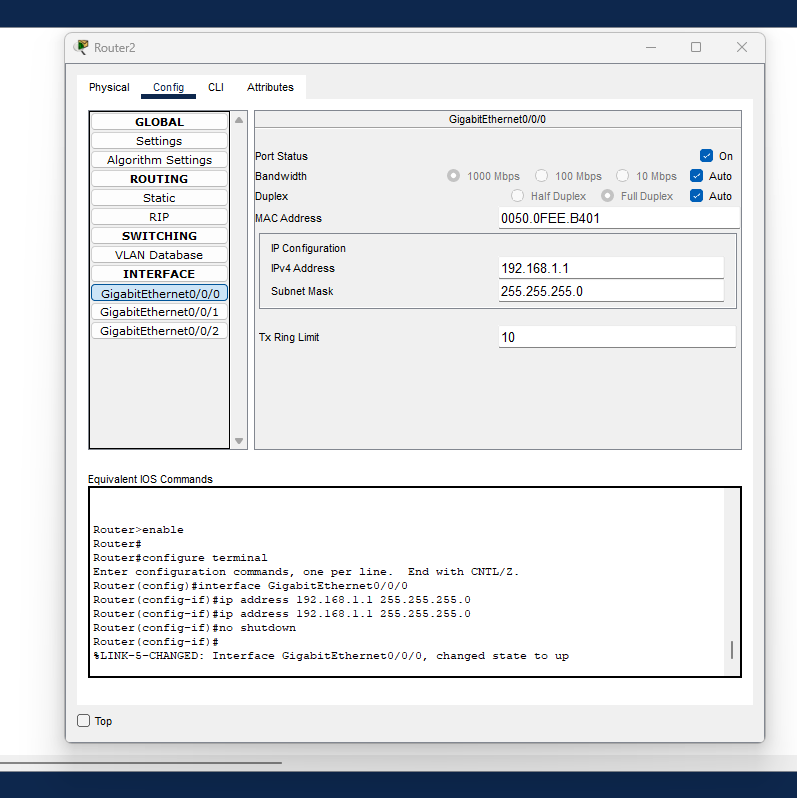
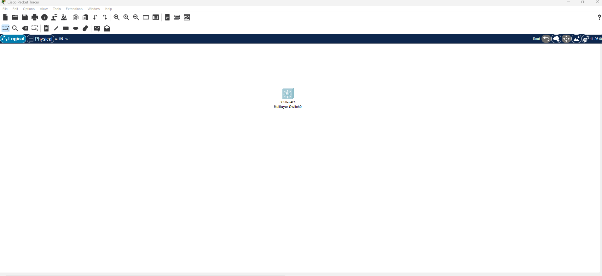

# Prise en main de l'interface CLI

## Exercice 1 : Configuration du CLI 

**Materiel requis**

- Un comutateur
- 2 PC
- Relier avec un cable les PC au comutateur (Switch)
- Cliquer sur le switch aller sur CLI



```cli
Switch>en
Switch#conf t
Enter configuration commands, one per line.  End with CNTL/Z.
Switch(config)#Vlan 10
Switch(config-vlan)#int Vlan 10
Switch(config-if)#exit
Switch(config)#int Fa0/1 
Switch(config-if)#switchport mode access
Switch(config-if)#switchport access Vlan 10
Switch(config-if)#
```

---

## Exercice 2 : des modes d'execution sur un switch cisco

**Materiel requis**

- Un comutateur (Switch)



- **Mode utilisateur :**
```cli
Switch>
```

- **Mode Privilegier :**
```cli
Switch>en	
Switch#
```	

- **Retour mode utilisateur :**
Commande pour quitter le mode privilegier
```cli	
Switch#disable
Switch>
```	

---

## Exercice 3 : Entrer et sortie du mode de configuration globale sur un routeur cisco

**Materiel requis**

- Un Routeur




- **Mode utilisateur :**
```cli
Would you like to enter the initial configuration dialog? [yes/no]: no


Press RETURN to get started!


Router>
```

- **Mode Privilegier :**
```cli
Router>en
Router#
```	

- **Enter mode configuration globale :**
```cli	
Router>en
Router#
Router#conf t
Enter configuration commands, one per line.  End with CNTL/Z.
Router(config)#
```	

- **Sortir du mode configuration globale :**
Commande pour quitter le mode configuration globale 
```cli	
Router>en
Router#
Router#conf t
Enter configuration commands, one per line.  End with CNTL/Z.
Router(config)#exit
Router#
%SYS-5-CONFIG_I: Configured from console by console

Router#
```

---


## Exercice 4 : Configuration de accès consol sur un routeur cisco

**Materiel requis**

- Un Routeur cisco



- **Mode Privilegier :**
```cli
Router>en
Router#
```	

- **Enter mode configuration globale :**
```cli	
Router>en
Router#
Router#conf t
Enter configuration commands, one per line.  End with CNTL/Z.
Router(config)#line console 0
Router(config-line)#
```	

---


## Exercice 5 : Configuration d'une interface réseau sur un routeur cisco

**Materiel requis**

- Un Routeur cisco



```cli
Router>en
Router#conf t
Enter configuration commands, one per line.  End with CNTL/Z.
Router(config)#interface GigabitEthernet0/0/1
Router(config-if)#ip address 192.168.2.1 255.255.255.0
Router(config-if)#no shut

Router(config-if)#
%LINK-5-CHANGED: Interface GigabitEthernet0/0/1, changed state to up

Router(config-if)#exit
Router(config)#
```

- **Configuration d'une interface réseau sur un routeur cisco en mode graphique**




---

## Exercice 7 : Configuration d'une interface SVI d'un switch

**Materiel requis**

- Un comutateur (Switch)



```cli
Switch>en
Switch#conf t
Enter configuration commands, one per line.  End with CNTL/Z.
Switch(config)#Vlan 10
Switch(config-vlan)#name "Vlan gestion"
Switch(config-vlan)#exit
Switch(config)#int Vlan 10
Switch(config-if)#
Switch(config-if)#ip address 192.168.1.1 255.255.255.0
Switch(config-if)#no shut
Switch(config-if)#exit
Switch(config)#ip default-gateway 192.168.1.1
Switch(config)#exit
Switch#
Switch#show Vlan
Switch#show ip interface brief
Switch#show ip route
```

- Pour la commande `Switch#show Vlan` le résultat attendue est :
```cli
Switch#show vlan

VLAN Name                             Status    Ports
---- -------------------------------- --------- -------------------------------
10   Vlan gestion                     active    
 

VLAN Type  SAID       MTU   Parent RingNo BridgeNo Stp  BrdgMode Trans1 Trans2
---- ----- ---------- ----- ------ ------ -------- ---- -------- ------ ------
10   enet  100010     1500  -      -      -        -    -        0      0
```

- Pour la commande `Switch#show ip interface brief` le résultat attendue est :
```cli
Switch#show ip interface brief
Interface              IP-Address      OK? Method Status                Protocol 
Vlan10                 192.168.1.1     YES manual up                    down
```

- Pour la commande `Switch#show ip route` le résultat attendue est :
```cli
Switch#show ip route
Default gateway is 192.168.1.1

Host               Gateway           Last Use    Total Uses  Interface
ICMP redirect cache is empty
```

---

## Exercice 8 : Vérification de la configuration SVI d'un switch cisco

**Materiel requis**

- Un comutateur (Switch)

- Pour la commande `Switch#show Vlan` le résultat attendue est :
```cli
Switch#show vlan

VLAN Name                             Status    Ports
---- -------------------------------- --------- -------------------------------
10   Vlan gestion                     active    
 

VLAN Type  SAID       MTU   Parent RingNo BridgeNo Stp  BrdgMode Trans1 Trans2
---- ----- ---------- ----- ------ ------ -------- ---- -------- ------ ------
10   enet  100010     1500  -      -      -        -    -        0      0
```

- Pour la commande `Switch#show ip interface brief` le résultat attendue est :
```cli
Switch#show ip interface brief
Interface              IP-Address      OK? Method Status                Protocol 
Vlan10                 192.168.1.1     YES manual up                    down
```

- Pour la commande `Switch#show ip route` le résultat attendue est :
```cli
Switch#show ip route
Default gateway is 192.168.1.1

Host               Gateway           Last Use    Total Uses  Interface
ICMP redirect cache is empty
```

---

## Exercice 9 : Changement du Vlan de gestion sur un switch cisco

**Materiel requis**

- Un comutateur (Switch)

```cli
Switch>en
Switch#conf t
Enter configuration commands, one per line.  End with CNTL/Z.
Switch(config)#Vlan 10                            
Switch(config-vlan)#name Vlan10
Switch(config-vlan)#exit
Switch(config)#no Vlan 10
Switch(config)#
```

---