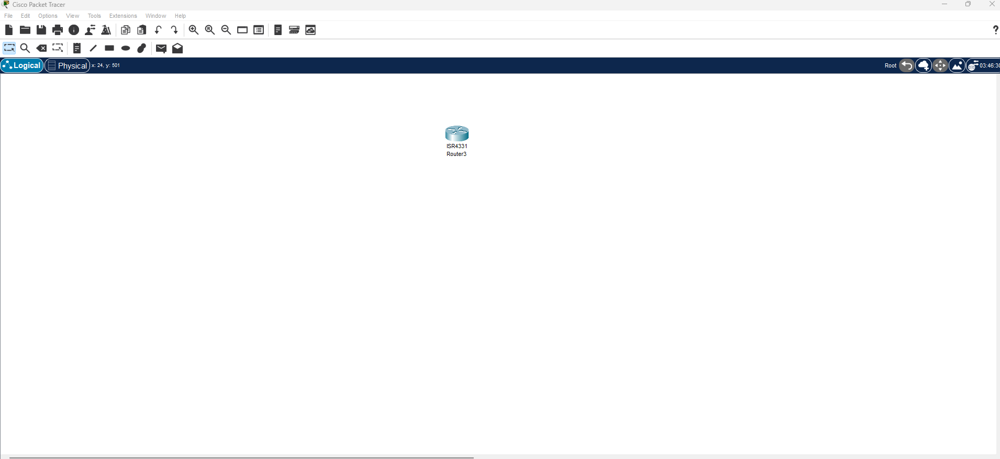
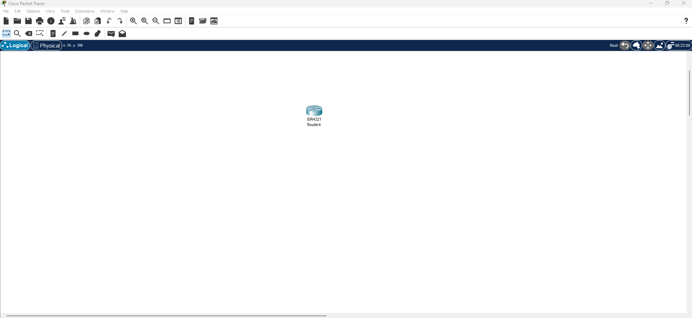
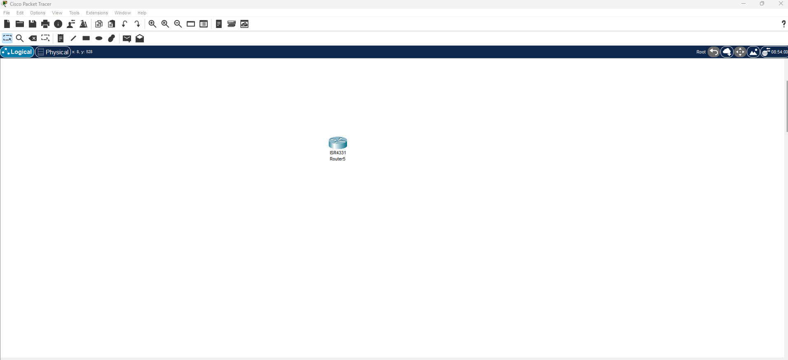
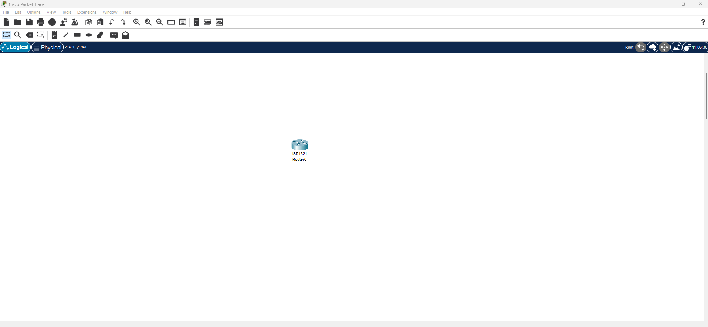
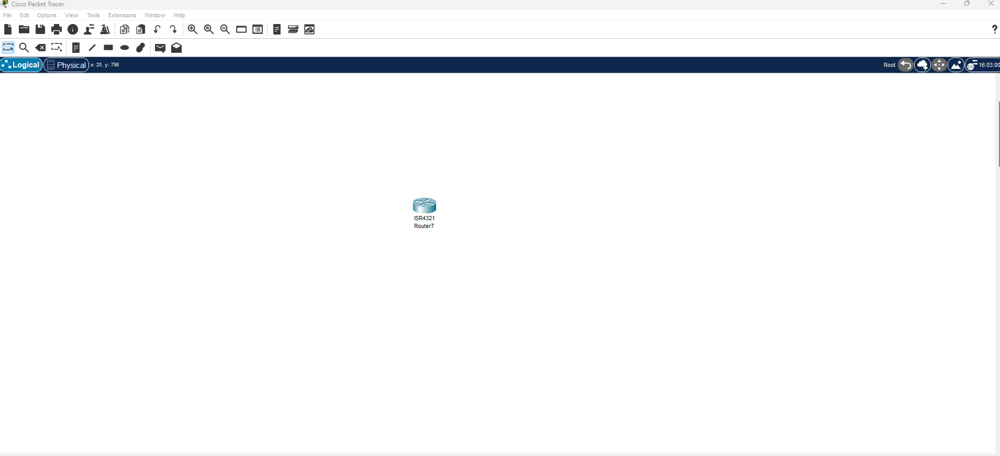
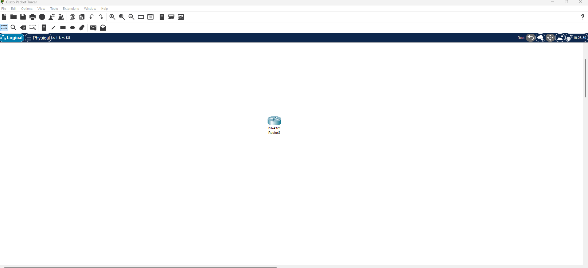

# Configuration d'un VPN

## Exercice 1 : Accés au mode de configuration

**Model router 4331**



```cli
Router>
Router>en
Router#conf t
Router(config)#
```

---

## Exercice 2 : Définition d'un nom d'hôte

**Model router 4321**



```cli
Router>
Router>en
Router#conf t
Router(config)#hostname RouteurVPN
RouteurVPN(config)#
```

---

## Exercice 3 : Configuration d'un Mot de Passe pour un mode privilégier

**Model router 4331**




```cli
Router>
Router>en
Router#conf t
Router(config)#enable secret monMotDePasse
Router(config)#exit
Router#
Router#disable
Router>en
Password: 
Router#
```
---

## Exercice 4 : Configuration de SSH

**Model router 4321**



```cli
Router>
Router>en
Router#conf t
Router(config)#ip domain-name mondomaine.com
Router(config)#hostname RouteurSSH
RouteurSSH(config)#crypto key generate rsa
RouteurSSH(config)#ip ssh version 2
*Mar 1 0:3:48.512: %SSH-5-ENABLED: SSH 2 has been enabled
RouteurSSH(config)#
RouteurSSH(config)#exit
RouteurSSH#
RouteurSSH#show ip ssh
SSH Enabled - version 2.0
RouteurSSH#
```
---

## Exercice 5 : Création d'un utilisateur Administrateur

**Model router 4321**



```cli
Router>
Router>en
Router#conf t
Router(config)#username admin privilege 15 secret monMotDePasse
Router(config)#
```

---

## Exercice 6 : Configuration des Mot de passe pour l'accés console

**Model router 4321**



```cli
Router>
Router>en
Router#conf t
Enter configuration commands, one per line.  End with CNTL/Z.
Router(config)#line console 0
Router(config-line)#password monmotdepasee
Router(config-line)#login
Router(config-line)#
```

---

