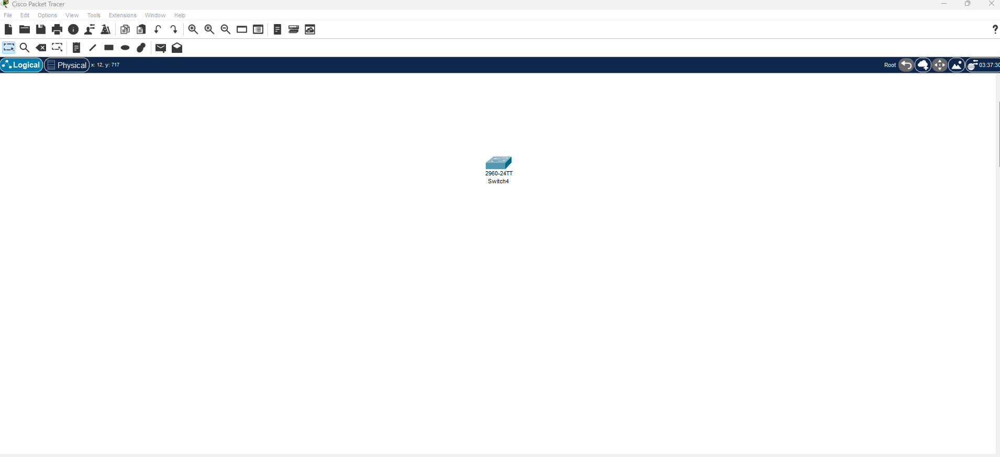

# Sécurité avec SSH

## Exercice 1 : Attribution d'un nom d'hôte et verification de la compatibiliter SSH sur un switch cisco

**Model switch 2960**


```cli
Switch>en
Switch#show version
Switch Ports Model              SW Version            SW Image
------ ----- -----              ----------            ----------
*    1 26    WS-C2960-24TT-L    15.0(2)SE4            C2960-LANBASEK9-M
Switch#
```
- La presence de **K9** dans le non de version se l'os (**SW Image**) indique que le switch prent en charge le SSH.


```cli
Switch#conf t              
Switch(config)#hostname MonSwitch
MonSwitch(config)#
```

## Exercice 2 : Configuration de l'adresse IP sur l'interface de gestion d'un switch cisco

**Model switch 2960**




```cli
Switch>en
Switch#conf t
Switch(config)#int Vlan 1
Switch(config-if)#ip address 192.168.1.2 255.255.255.0
Switch(config-if)#no shut
Switch(config-if)#
Switch(config-if)#exit
Switch(config)#exit
Switch#
```

---