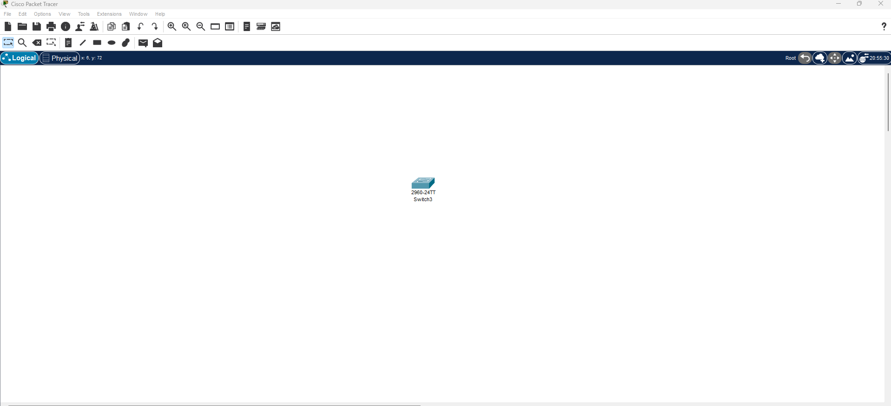

# Sécurité avec SSH

## Exercice 1 : Attribution d'un nom d'hôte et verification de la compatibiliter SSH sur un switch cisco

**Model switch 2960**



```cli
Switch>
Switch>en
Switch#show version
Switch Ports Model              SW Version            SW Image
------ ----- -----              ----------            ----------
*    1 26    WS-C2960-24TT-L    15.0(2)SE4            C2960-LANBASEK9-M
Switch#
```
- La presence de **K9** dans le non de version se l'os (**SW Image**) indique que le switch prent en charge le SSH.


```cli
Switch>
Switch>en
Switch#conf t              
Switch(config)#hostname MonSwitch
MonSwitch(config)#
```

## Exercice 2 : Configuration de l'adresse IP sur l'interface de gestion d'un switch cisco

**Model switch 2960**


```cli
Switch>
Switch>en
Switch#conf t
Switch(config)#int Vlan 1
Switch(config-if)#ip address 192.168.1.2 255.255.255.0
Switch(config-if)#no shut
Switch(config-if)#
Switch(config-if)#exit
Switch(config)#exit
Switch#
```

---

## Exercice 3 : Définition d'un mot de passe secret sur un switch cisco

**Model switch 2960**


```cli
Switch>
Switch>en
Switch#conf t
Switch(config)#enable secret monmotdepassesecret
Switch#reload
Switch>en
Password: 
Switch#
```

---

## Exercice 4 : Définiton du domaine et activation de SSH V2 sur un switch cisco

**Model switch 2960**


```cli
Switch>
Switch>en
Switch#conf t
Switch(config)#ip domain-name mondomaine.local
Switch(config)#line vty 0 15
Switch(config-line)#transport input ssh
Switch(config-line)#exit
Switch(config)#exit
Switch#
Switch#write memory
Switch#
```

## Exercice 5 : Génération d'une clée de cryptographie RSA sur un switch cisco

**Model switch 2960**


```cli	
Switch>
Switch>en
Switch#conf t
Switch(config)#line vty 0 15
Switch(config-line)#crypto key generate rsa
Switch(config)#hostname monSwitch
monSwitch(config)#ip domain-name mondomain.local
monSwitch(config)#crypto key generate rsa
How many bits in the modulus [512]: 1024
monSwitch(config)#exit
monSwitch#
monSwitch#write memory
monSwitch#
```

---

## Exercice 6 : Création d'un utilisateur pour SSH sur un switch cisco

**Model switch 2960**


```cli
Switch>
Switch>en
Switch#conf t
Switch(config)#username monUtilisateur secret monMotDePasseSecret
Switch(config)#exit
Switch#
Switch#write memory
Switch#
```

---

## Exercice 7 : Configuration de acces VTY sur un switch cisco

**Model switch 2960**


```cli
Switch>
Switch>en
Switch#conf t
Switch(config)#line vty 0 15
Switch(config-line)#transport input ssh
Switch(config-line)#login local
Switch(config-line)#exit
Switch(config)#exit
Switch#
Switch#write memory
Switch#
```

---

## Exercice 8 : Analyse de la sécurité ssh sur un switch cisco

**Model switch 2960**


```cli	

```