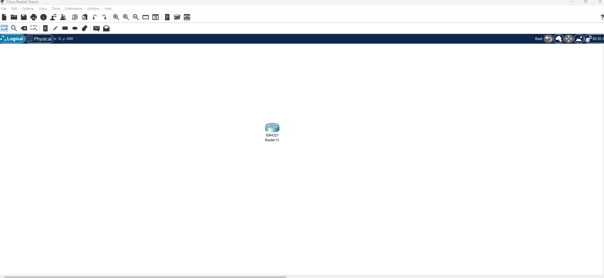
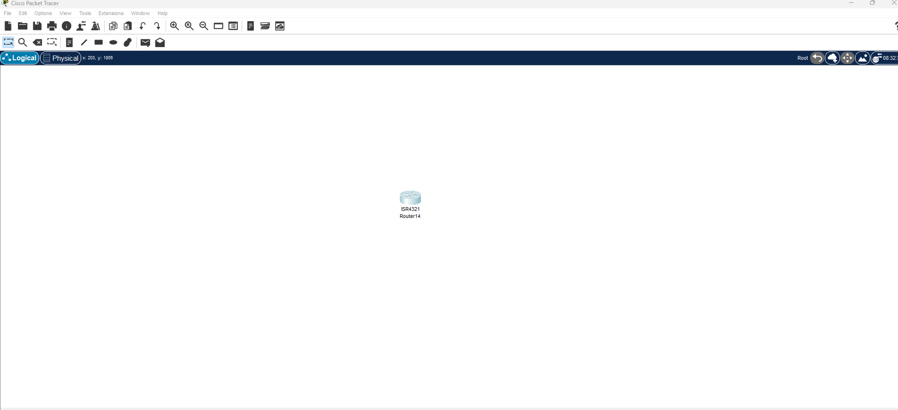
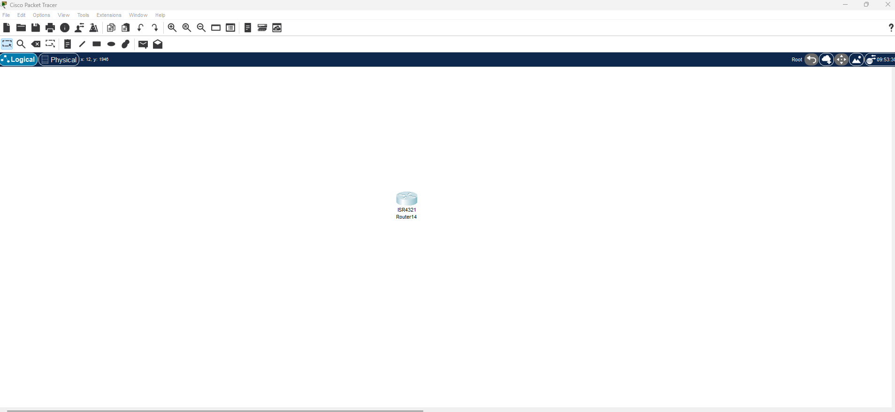
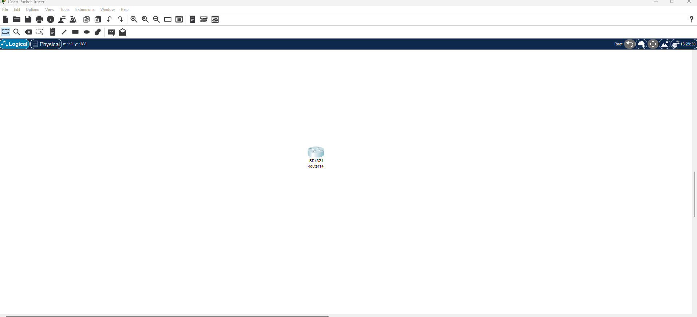

# Sauvegard et gestion des configuration des équipements Cisco en utilisant Cisco IOS File System (IFS)

## Exercice 1 : Affichage des système de fichier Disponibles

**Model Routeur 4321**



```cli
Router>
Router>en
Router#show file system
File Systems:

       Size(b)       Free(b)      Type  Flags  Prefixes
*   3249049600    2761893909     flash     rw  flash:
         29688         23590     nvram     rw  nvram:
Router#
```

---

## Exercice 2 : Exploration du répertoire flash

**Model Routeur 4321**



```cli
Router>
Router>en
Router#dir flash:
Directory of flash:/

    3  -rw-   486899872          <no date>  isr4300-universalk9.03.16.05.S.155-3.S5-ext.SPA.bin
    2  -rw-       28282          <no date>  sigdef-category.xml
    1  -rw-      227537          <no date>  sigdef-default.xml

Router#
```

---

## Exercice 3 : Sauvegarde de la configuration actielle

**Model Routeur 4321**



```cli
Router>
Router>en
Router#copy running-config startup-config
Destination filename [startup-config]? 

[OK]
Router#
```

---

## Exercice 4 : Réstoration de la configuration de démarrage

**Model Routeur 4321**



```cli
Router>
Router>en
Router#copy startup-config running-config
Destination filename [running-config]? 
Router#
```

---
