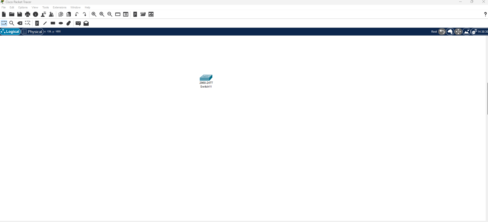
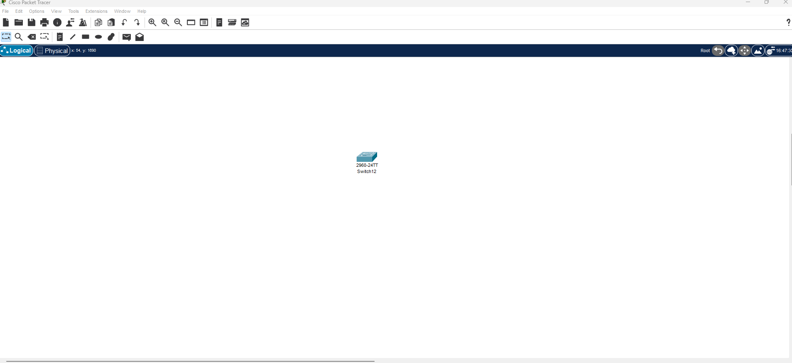
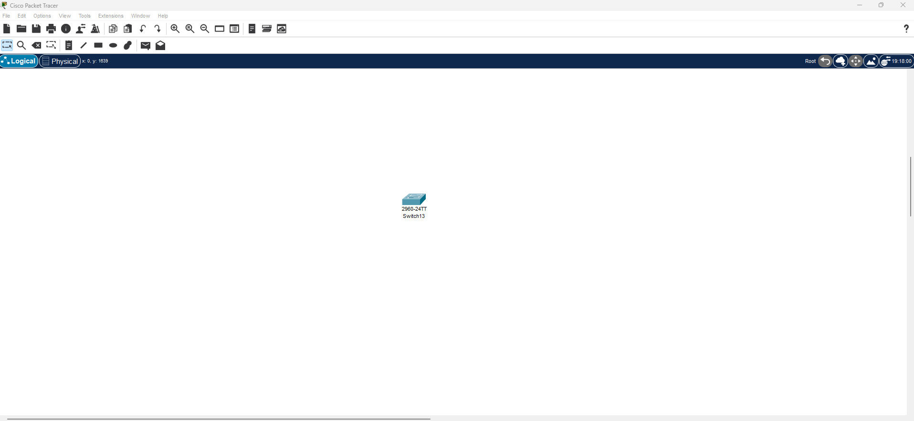
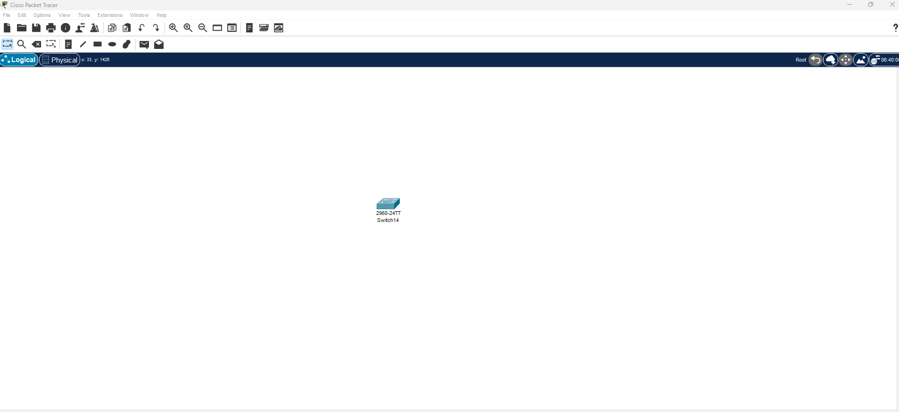
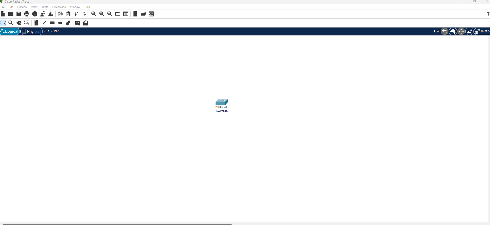
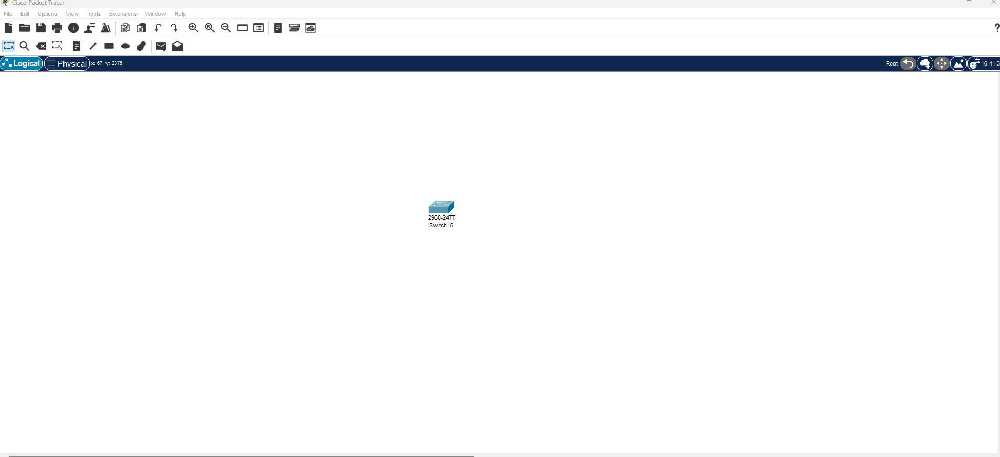
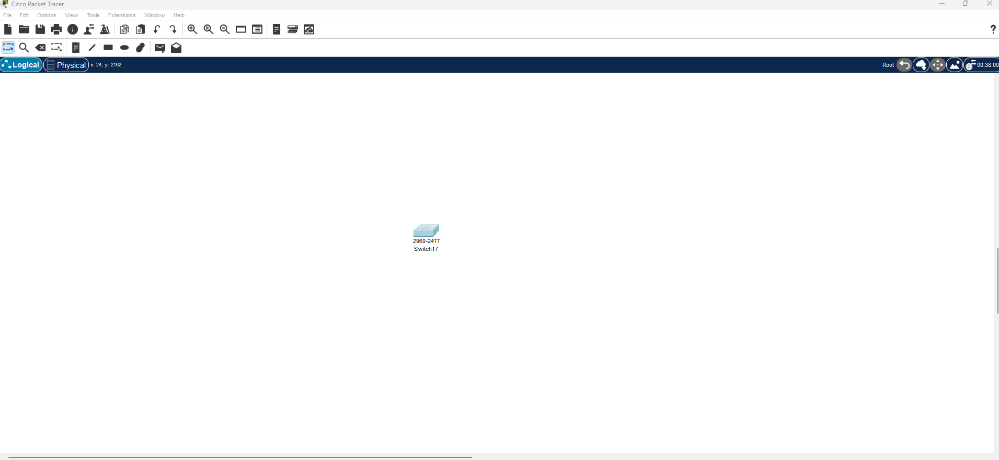
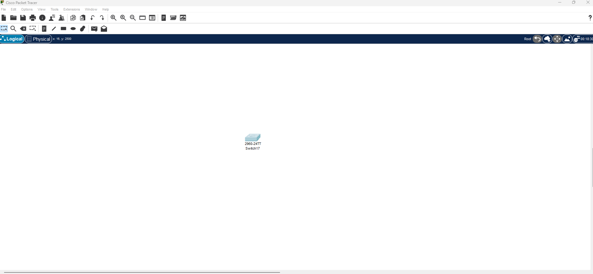

# Exercice les Vlan avec cisco Packet Tracer

## Exercice 1 : Vérification du Vlan par défaut

**Model switch 2960**



```cli
Switch>
Switch>show Vlan brief

VLAN Name                             Status    Ports
---- -------------------------------- --------- -------------------------------
1    default                          active    Fa0/1, Fa0/2, Fa0/3, Fa0/4
                                                Fa0/5, Fa0/6, Fa0/7, Fa0/8
                                                Fa0/9, Fa0/10, Fa0/11, Fa0/12
                                                Fa0/13, Fa0/14, Fa0/15, Fa0/16
                                                Fa0/17, Fa0/18, Fa0/19, Fa0/20
                                                Fa0/21, Fa0/22, Fa0/23, Fa0/24
                                                Gig0/1, Gig0/2
1002 fddi-default                     active    
1003 token-ring-default               active    
1004 fddinet-default                  active    
1005 trnet-default                    active    
Switch>
```

---

## Exercice 2 : Création d'un Vlan de Donner 

**Model switch 2960**



```cli
Switch>
Switch>en
Switch#conf t
Switch(config)#Vlan 10
Switch(config-vlan)#name Utilisateur
Switch(config-vlan)#exit
Switch(config)#exit
Switch#
Switch#show Vlan brief

VLAN Name                             Status    Ports
---- -------------------------------- --------- -------------------------------
1    default                          active    Fa0/1, Fa0/2, Fa0/3, Fa0/4
                                                Fa0/5, Fa0/6, Fa0/7, Fa0/8
                                                Fa0/9, Fa0/10, Fa0/11, Fa0/12
                                                Fa0/13, Fa0/14, Fa0/15, Fa0/16
                                                Fa0/17, Fa0/18, Fa0/19, Fa0/20
                                                Fa0/21, Fa0/22, Fa0/23, Fa0/24
                                                Gig0/1, Gig0/2
10   Utilisateur                      active    
1002 fddi-default                     active    
1003 token-ring-default               active    
1004 fddinet-default                  active    
1005 trnet-default                    active    
Switch#
```

---

## Exercise 3 : Changement du Vlan natif sur un port trunk

**Model switch 2960**



```cli
Switch>
Switch>en
Switch#conf t
Switch(config)#int gigabitEthernet0/1
Switch(config-if)#switchport mode trunk
Switch(config-if)#switchport trunk native Vlan 99
Switch(config-if)#exit
Switch(config)#exit
Switch#
Switch#show interface trunk
Switch#
```

---

## Exercice 4 : Configuration d'un Vlan de gestion

**Model switch 2960**



```cli
Switch>
Switch>en
Switch#conf t
Switch(config)#Vlan 20
Switch(config-vlan)#name Gestion
Switch(config-vlan)#exit
Switch(config)#int g0/1
Switch(config-if)#switchport mode access
Switch(config-if)#switchport access Vlan 20
Switch(config-if)#exit
Switch(config)#int Vlan 20
Switch(config-if)#
Switch(config-if)#ip address 192.168.1.1 255.255.255.0
Switch(config-if)#no shut
Switch(config-if)#exit
Switch(config)#exit
Switch#
Switch#show Vlan

VLAN Name                             Status    Ports
---- -------------------------------- --------- -------------------------------
20   Gestion                          active    Gig0/1
  

VLAN Type  SAID       MTU   Parent RingNo BridgeNo Stp  BrdgMode Trans1 Trans2
---- ----- ---------- ----- ------ ------ -------- ---- -------- ------ ------
20   enet  100020     1500  -      -      -        -    -        0      0

Switch#
```

---

## Exercice 5 : Création d'un Vlan voix

**Model switch 2960**



```cli
Switch>
Switch>en
Switch#conf t
Switch(config)#Vlan 30
Switch(config-vlan)#name Voix
Switch(config-vlan)#exit
Switch(config)#int g0/1
Switch(config-if)#switchport mode access
Switch(config-if)#switchport access Vlan 30
Switch(config-if)#exit
Switch(config)#mls qos
Switch(config)#exit
Switch#
Switch#show Vlan brief

VLAN Name                             Status    Ports
---- -------------------------------- --------- -------------------------------
30   Voix                             active    Gig0/1
  
Switch#show interface gigabitEthernet0/1 switchport
Name: Gig0/1
Switchport: Enabled
Administrative Mode: static access
Operational Mode: down
Administrative Trunking Encapsulation: dot1q
Operational Trunking Encapsulation: native
Negotiation of Trunking: Off
Access Mode VLAN: 30 (Voix)
Trunking Native Mode VLAN: 1 (default)
Voice VLAN: none
Administrative private-vlan host-association: none
Administrative private-vlan mapping: none
Administrative private-vlan trunk native VLAN: none
Administrative private-vlan trunk encapsulation: dot1q
Administrative private-vlan trunk normal VLANs: none
Administrative private-vlan trunk private VLANs: none
Operational private-vlan: none
Trunking VLANs Enabled: All
Pruning VLANs Enabled: 2-1001
Capture Mode Disabled
Capture VLANs Allowed: ALL
Protected: false
Unknown unicast blocked: disabled
Unknown multicast blocked: disabled
Appliance trust: none


Switch#
```

---

## Exercice 6 : Vérification des Vlan créer

**Model switch 2960**

```cli
Switch#show vlan brief

VLAN Name                             Status    Ports
---- -------------------------------- --------- -------------------------------
30   Voix                             active    Gig0/1

Switch#
```

---

## Exercice 7 : Modification de l'apartenence d'un port a un Vlan

**Model switch 2960**



```cli
Switch>en
Switch#conf t
Switch(config)#Vlan 10
Switch(config-vlan)#name "Vlan Exo"
Switch(config-vlan)#exit
Switch(config)#int g0/1
Switch(config-if)#switchport mode access
Switch(config-if)#switchport access Vlan 10
Switch(config-if)#exit
Switch(config)#int Fa0/1
Switch(config-if)#switchport mode access
Switch(config-if)#switchport access Vlan 10
Switch(config-if)#exit
Switch(config)#exit
Switch#
Switch#show interfaces status

Port      Name               Status       Vlan       Duplex  Speed Type
Fa0/1                        notconnect   10         auto    auto  10/100BaseTX

Switch#
```
---

## Exercice 8 : Supprétion d'un Vlan de Donner

**Model switch 2960**



```cli
Switch>
Switch>en
Switch#conf t
Switch(config)#Vlan 10
Switch(config-vlan)#exit
Switch(config)#int Fa0/1	
Switch(config-if)#switchport access Vlan 1
Switch(config-if)#exit
Switch(config)#no Vlan 10
Switch(config)#exit
Switch#
Switch#show vlan brief

VLAN Name                             Status    Ports
---- -------------------------------- --------- -------------------------------
1    default                          active    Fa0/1, Fa0/2, Fa0/3, Fa0/4
                                                Fa0/5, Fa0/6, Fa0/7, Fa0/8
                                                Fa0/9, Fa0/10, Fa0/11, Fa0/12
                                                Fa0/13, Fa0/14, Fa0/15, Fa0/16
                                                Fa0/17, Fa0/18, Fa0/19, Fa0/20
                                                Fa0/21, Fa0/22, Fa0/23, Fa0/24
                                                Gig0/1, Gig0/2
1002 fddi-default                     active    
1003 token-ring-default               active    
1004 fddinet-default                  active    
1005 trnet-default                    active    
Switch#
```

---

## Exercice 9 : Réafectation des port aprés la suppression d'un Vlan

**Model switch 2960**



```cli
Switch>
Switch>en
Switch#conf t
Switch(config)#int g0/1
Switch(config-if)#switchport access Vlan 1
Switch(config-if)#exit
Switch(config)#exit
Switch#
Switch#show vlan brief

VLAN Name                             Status    Ports
---- -------------------------------- --------- -------------------------------
1    default                          active    Fa0/1, Fa0/2, Fa0/3, Fa0/4
                                                Fa0/5, Fa0/6, Fa0/7, Fa0/8
                                                Fa0/9, Fa0/10, Fa0/11, Fa0/12
                                                Fa0/13, Fa0/14, Fa0/15, Fa0/16
                                                Fa0/17, Fa0/18, Fa0/19, Fa0/20
                                                Fa0/21, Fa0/22, Fa0/23, Fa0/24
                                                Gig0/1, Gig0/2
  
Switch#
```

---

