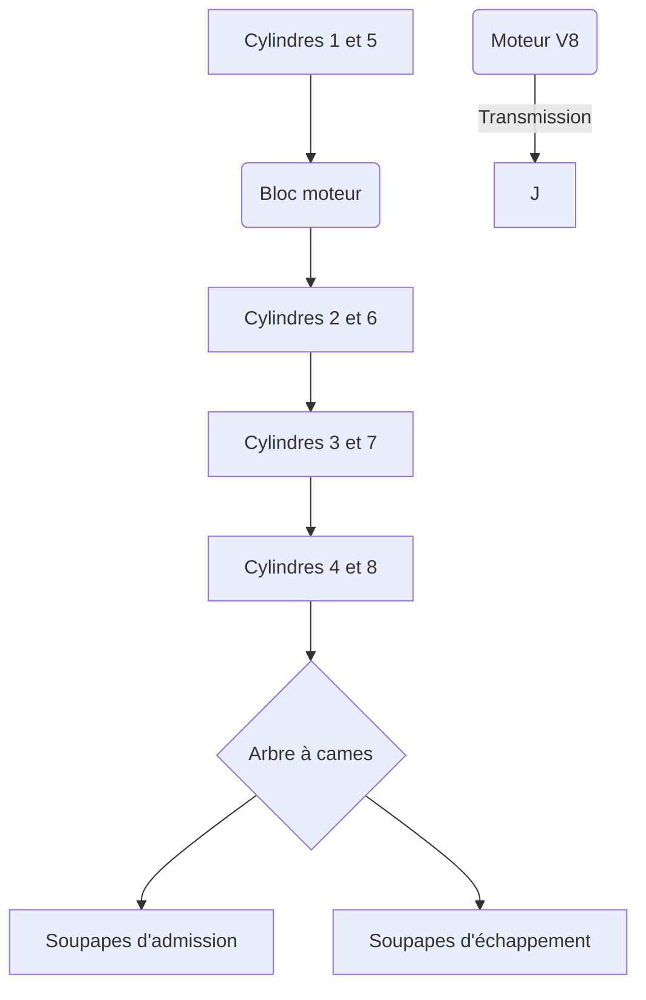

# Notes


- **Attribution d'une ip à un vlan**
```cli
Switch(config)#int Vlan 20
Switch(config-if)#ip address 172.16.1.2 255.255.0.0
Switch(config-if)#no shut
Switch(config-if)#exit
Switch(config)#
```

- **Attribution ip à une vlan**
```cli
Router>enable
Router#
Router#configure terminal
Enter configuration commands, one per line.  End with CNTL/Z.
Router(config)#interface GigabitEthernet0/0/0
Router(config-if)#ip address 192.168.3.1 255.255.255.0
Router(config-if)#ip address 192.168.3.1 255.255.255.0
Router(config-if)#no shutdown
Router(config-if)#
```


---


---

```cli

Router>en
Router#conf t
Enter configuration commands, one per line.  End with CNTL/Z.
Router(config)#
```

---

- **Exemple schema mermaid**



