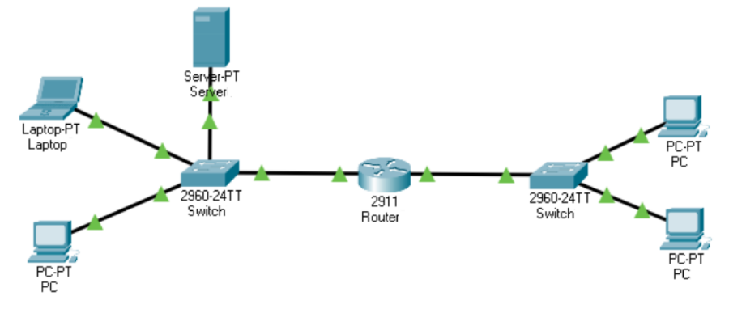
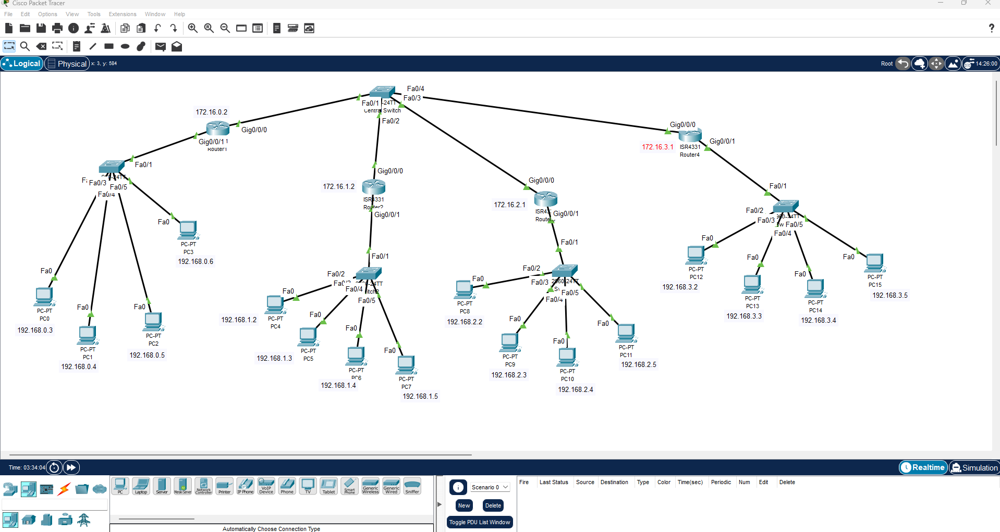

# Notes


- **Attribution d'une ip à un vlan**
```cli
Switch(config)#int Vlan 20
Switch(config-if)#ip address 172.16.1.2 255.255.0.0
Switch(config-if)#no shut
Switch(config-if)#exit
Switch(config)#
```

- **Attribution ip à une vlan**
```cli
Router>enable
Router#
Router#configure terminal
Enter configuration commands, one per line.  End with CNTL/Z.
Router(config)#interface GigabitEthernet0/0/0
Router(config-if)#ip address 192.168.3.1 255.255.255.0
Router(config-if)#ip address 192.168.3.1 255.255.255.0
Router(config-if)#no shutdown
Router(config-if)#
```



---



---

```cli

Router>en
Router#conf t
Enter configuration commands, one per line.  End with CNTL/Z.
Router(config)#
```

---

- **Exemple schema mermaid**

```mermaid
graph LR;
    A[Connexion au périphérique] --> B{Mode utilisateur ?};
    B -->|Non| C[Passer en mode d'administration (enable)];
    C --> D[Configurer le mot de passe enable (enable password)];
    D --> E[Configurer le mot de passe chiffré (enable secret)];
    E --> F[Configurer l'authentification utilisateur (username/password)];
    F --> G{Configuration réseau ?};
    G -->|Oui| H[Accéder au mode de configuration (configure terminal)];
    H --> I[Configurer les interfaces (interface, ip address, description, no shutdown)];
    I --> J[Configurer le routage (router, network, ip route)];
    J --> K[Configurer la sécurité (access-lists, etc.)];
    K --> L[Sauvegarder la configuration (copy running-config startup-config)];
    L --> M[Terminer la session];
    G -->|Non| M[Terminer la session];
    B -->|Oui| M[Terminer la session];


```

