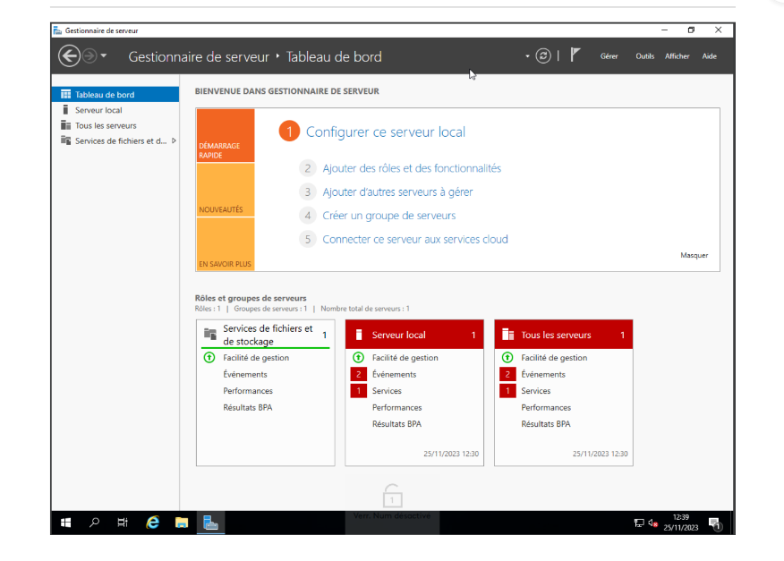
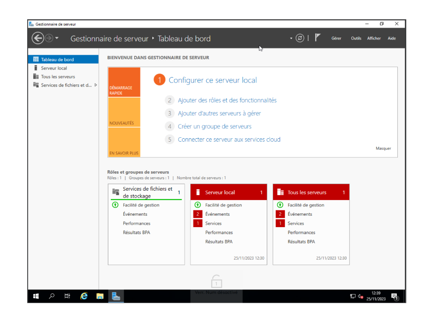
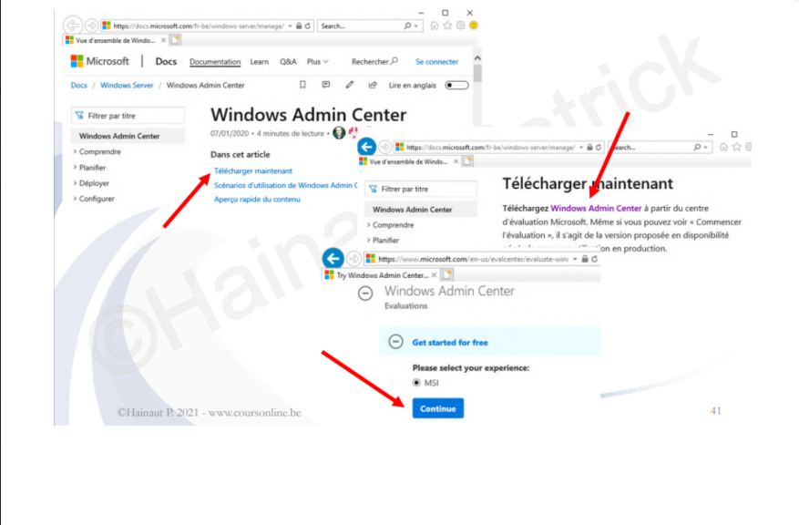

# **2-Decouverte-Windows-Server**

## **Découverte de Windows Server**

# **Tableau de bord du Gestionnaire de Serveur**

Le Tableau de Bord du Gestionnaire de Serveur est le point central de l'administration sous Windows
Server 2019. Il offre une vue d'ensemble des rôles, fonctionnalités et performances du serveur. En tant
que première interface après la connexion, il présente les informations cruciales telles que le statut
global du serveur, la configuration matérielle et les alertes éventuelles. Ce tableau de bord constitue
l'élément essentiel pour gérer efficacement votre serveur.

## **Serveur Local**

Dans la partie "Démarrage rapide", on dispose du menu "Configurer ce Serveur Local". Un serveur local
dans Windows Server 2019 fait référence à la machine sur laquelle le système d'exploitation Windows
Server est installé et exécuté. C'est le serveur physique ou virtuel qui héberge divers rôles,
fonctionnalités et services pour répondre aux besoins d'un réseau ou d'une organisation. Le serveur
local joue un rôle central dans l'administration du réseau, offrant des services tels que le stockage de

fichiers, l'authentification des utilisateurs, le partage de ressources, la gestion des politiques de sécurité,
et bien plus encore. Il constitue le point focal où les administrateurs peuvent configurer, surveiller et
maintenir les opérations du serveur. En résumé, le serveur local dans Windows Server 2019 est le
nœud principal du réseau, fournissant les services et les ressources nécessaires pour assurer le bon
fonctionnement de l'infrastructure informatique de l'organisation.

# **Fonctionnalités du Menu de Démarrage Rapide**

 - Ajouter des Rôles et des Fonctionnalités : Le menu "Ajouter des Rôles et des Fonctionnalités"
dans Windows Server 2019 simplifie la personnalisation du serveur. Il offre une interface guidée
pour installer des rôles (services) et des fonctionnalités spécifiques. Cela permet d'adapter le
serveur aux besoins, d'optimiser les ressources en n'installant que ce qui est nécessaire, et de
gérer efficacement les fonctionnalités depuis le tableau de bord du Gestionnaire de Serveur. Ce
menu centralise les options de configuration, facilitant la gestion des services et contribuant à
l'efficacité opérationnelle du serveur.

 - Ajouter d'autres Serveurs à Gérer : Le menu "Ajouter d'autres Serveurs à Gérer" dans Windows
Server 2019 offre une fonctionnalité de gestion centralisée. En utilisant cet outil, les administrateurs
peuvent intégrer d'autres serveurs dans l'environnement, facilitant ainsi la surveillance et
l'administration à partir d'un emplacement central. Cela permet une gestion efficace des serveurs
dans un réseau, offrant une vue consolidée et simplifiée pour les tâches administratives. L'ajout de
serveurs supplémentaires peut se faire de manière transparente, améliorant la scalabilité et
l'efficacité opérationnelle du réseau.

 - Créer un Groupe de Serveur : L'option "Créer un Groupe de Serveur" dans Windows Server 2019
propose une fonctionnalité permettant d'organiser et de gérer plusieurs serveurs de manière plus
structurée. En créant des groupes, les administrateurs peuvent catégoriser les serveurs en fonction
de critères spécifiques tels que les rôles, les départements ou d'autres paramètres pertinents. Cela
simplifie la gestion en permettant des actions simultanées sur plusieurs serveurs, renforçant ainsi
l'efficacité opérationnelle. Les groupes de serveurs offrent également une manière plus intuitive de
naviguer dans l'environnement du Gestionnaire de Serveur, facilitant ainsi la maintenance et la
surveillance.

 - Connecter ce Serveur aux Services Cloud : L'option "Connecter ce Serveur aux Services Cloud"
dans Windows Server 2019 offre la possibilité d'intégrer le serveur local avec des services cloud,
tels que ceux proposés par Microsoft Azure. Cette connexion cloud permet d'étendre les
fonctionnalités du serveur en exploitant des services distants, offrant ainsi des avantages tels que le
stockage en nuage, la sauvegarde en ligne, ou d'autres fonctionnalités basées sur le cloud. Cette
intégration favorise la flexibilité et l'évolutivité du serveur, renforçant ainsi sa capacité à répondre
aux besoins changeants de l'entreprise tout en profitant des avantages offerts par les services
cloud.

---

# **Windows Admin Center**

**Windows Admin Center** est une interface de gestion basée sur le web pour les serveurs Windows,
conçue pour simplifier et centraliser l'administration des serveurs. Elle offre une alternative aux outils
d'administration traditionnels basés sur des interfaces utilisateur graphiques (GUI) locales.

# **Caractéristiques et Fonctionnalités Clés**

 - **Interface Web :** Windows Admin Center est accessible via un navigateur web, permettant aux
administrateurs de gérer leurs serveurs à partir de n'importe quel appareil disposant d'une
connexion réseau.

 - **Gestion Centralisée :** Il offre une interface centralisée pour la gestion des serveurs, permettant aux
administrateurs de configurer, surveiller et dépanner plusieurs serveurs à partir d'un emplacement
unique.

 - **Prise en Charge des Versions Récentes de Windows Server :** Windows Admin Center prend en
charge les versions récentes de Windows Server, y compris Windows Server 2012, 2012 R2, 2016,
2019 et les versions ultérieures.

 - **Gestion des Rôles et Fonctionnalités :** Il permet la gestion des rôles, des fonctionnalités et des
services installés sur les serveurs, simplifiant ainsi les opérations d'administration.

 - **Surveillance des Performances :** Windows Admin Center offre des outils de surveillance des
performances pour suivre l'utilisation des ressources telles que le processeur, la mémoire et le
stockage.

 - **Gestion des Machines Virtuelles :** Il offre des fonctionnalités de gestion des machines virtuelles
via Hyper-V, permettant de créer, modifier et surveiller des machines virtuelles.

 - **Gestion du Stockage :** Windows Admin Center permet la gestion du stockage, y compris la
configuration des pools de stockage et des espaces de stockage direct.

 - **Outils de Sécurité :** Il propose des outils de sécurité pour la gestion des mises à jour, la
configuration du pare-feu, et d'autres paramètres de sécurité.

En résumé, Windows Admin Center simplifie l'administration des serveurs Windows en fournissant une
interface web centralisée, accessible à distance, pour la gestion de divers aspects tels que les rôles, les
fonctionnalités, la surveillance des performances, et d'autres paramètres.

---
