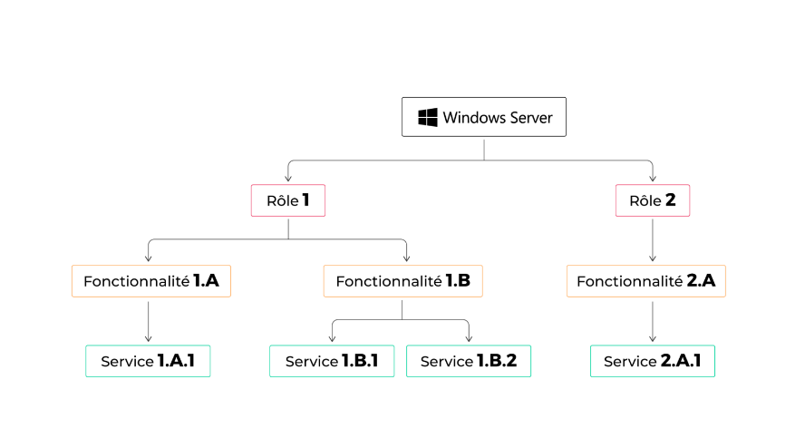

# **2-Decouverte-Windows-Server**

## **Découverte de Windows Server**

# **Tableau de bord du Gestionnaire de Serveur**

Le Tableau de Bord du Gestionnaire de Serveur est le point central de l'administration sous Windows
Server 2019. Il offre une vue d'ensemble des rôles, fonctionnalités et performances du serveur. En tant
que première interface après la connexion, il présente les informations cruciales telles que le statut
global du serveur, la configuration matérielle et les alertes éventuelles. Ce tableau de bord constitue
l'élément essentiel pour gérer efficacement votre serveur.

## **Serveur Local**

Dans la partie "Démarrage rapide", on dispose du menu "Configurer ce Serveur Local". Un serveur local
dans Windows Server 2019 fait référence à la machine sur laquelle le système d'exploitation Windows
Server est installé et exécuté. C'est le serveur physique ou virtuel qui héberge divers rôles,
fonctionnalités et services pour répondre aux besoins d'un réseau ou d'une organisation. Le serveur
local joue un rôle central dans l'administration du réseau, offrant des services tels que le stockage de

fichiers, l'authentification des utilisateurs, le partage de ressources, la gestion des politiques de sécurité,
et bien plus encore. Il constitue le point focal où les administrateurs peuvent configurer, surveiller et
maintenir les opérations du serveur. En résumé, le serveur local dans Windows Server 2019 est le
nœud principal du réseau, fournissant les services et les ressources nécessaires pour assurer le bon
fonctionnement de l'infrastructure informatique de l'organisation.

# **Fonctionnalités du Menu de Démarrage Rapide**

 - Ajouter des Rôles et des Fonctionnalités : Le menu "Ajouter des Rôles et des Fonctionnalités"
dans Windows Server 2019 simplifie la personnalisation du serveur. Il offre une interface guidée
pour installer des rôles (services) et des fonctionnalités spécifiques. Cela permet d'adapter le
serveur aux besoins, d'optimiser les ressources en n'installant que ce qui est nécessaire, et de
gérer efficacement les fonctionnalités depuis le tableau de bord du Gestionnaire de Serveur. Ce
menu centralise les options de configuration, facilitant la gestion des services et contribuant à
l'efficacité opérationnelle du serveur.

 - Ajouter d'autres Serveurs à Gérer : Le menu "Ajouter d'autres Serveurs à Gérer" dans Windows
Server 2019 offre une fonctionnalité de gestion centralisée. En utilisant cet outil, les administrateurs
peuvent intégrer d'autres serveurs dans l'environnement, facilitant ainsi la surveillance et
l'administration à partir d'un emplacement central. Cela permet une gestion efficace des serveurs
dans un réseau, offrant une vue consolidée et simplifiée pour les tâches administratives. L'ajout de
serveurs supplémentaires peut se faire de manière transparente, améliorant la scalabilité et
l'efficacité opérationnelle du réseau.

 - Créer un Groupe de Serveur : L'option "Créer un Groupe de Serveur" dans Windows Server 2019
propose une fonctionnalité permettant d'organiser et de gérer plusieurs serveurs de manière plus
structurée. En créant des groupes, les administrateurs peuvent catégoriser les serveurs en fonction
de critères spécifiques tels que les rôles, les départements ou d'autres paramètres pertinents. Cela
simplifie la gestion en permettant des actions simultanées sur plusieurs serveurs, renforçant ainsi
l'efficacité opérationnelle. Les groupes de serveurs offrent également une manière plus intuitive de
naviguer dans l'environnement du Gestionnaire de Serveur, facilitant ainsi la maintenance et la
surveillance.

 - Connecter ce Serveur aux Services Cloud : L'option "Connecter ce Serveur aux Services Cloud"
dans Windows Server 2019 offre la possibilité d'intégrer le serveur local avec des services cloud,
tels que ceux proposés par Microsoft Azure. Cette connexion cloud permet d'étendre les
fonctionnalités du serveur en exploitant des services distants, offrant ainsi des avantages tels que le
stockage en nuage, la sauvegarde en ligne, ou d'autres fonctionnalités basées sur le cloud. Cette
intégration favorise la flexibilité et l'évolutivité du serveur, renforçant ainsi sa capacité à répondre
aux besoins changeants de l'entreprise tout en profitant des avantages offerts par les services
cloud.

---

# **Windows Admin Center**

**Windows Admin Center** est une interface de gestion basée sur le web pour les serveurs Windows,
conçue pour simplifier et centraliser l'administration des serveurs. Elle offre une alternative aux outils
d'administration traditionnels basés sur des interfaces utilisateur graphiques (GUI) locales.

# **Caractéristiques et Fonctionnalités Clés**

 - **Interface Web :** Windows Admin Center est accessible via un navigateur web, permettant aux
administrateurs de gérer leurs serveurs à partir de n'importe quel appareil disposant d'une
connexion réseau.

 - **Gestion Centralisée :** Il offre une interface centralisée pour la gestion des serveurs, permettant aux
administrateurs de configurer, surveiller et dépanner plusieurs serveurs à partir d'un emplacement
unique.

 - **Prise en Charge des Versions Récentes de Windows Server :** Windows Admin Center prend en
charge les versions récentes de Windows Server, y compris Windows Server 2012, 2012 R2, 2016,
2019 et les versions ultérieures.

 - **Gestion des Rôles et Fonctionnalités :** Il permet la gestion des rôles, des fonctionnalités et des
services installés sur les serveurs, simplifiant ainsi les opérations d'administration.

 - **Surveillance des Performances :** Windows Admin Center offre des outils de surveillance des
performances pour suivre l'utilisation des ressources telles que le processeur, la mémoire et le
stockage.

 - **Gestion des Machines Virtuelles :** Il offre des fonctionnalités de gestion des machines virtuelles
via Hyper-V, permettant de créer, modifier et surveiller des machines virtuelles.

 - **Gestion du Stockage :** Windows Admin Center permet la gestion du stockage, y compris la
configuration des pools de stockage et des espaces de stockage direct.

 - **Outils de Sécurité :** Il propose des outils de sécurité pour la gestion des mises à jour, la
configuration du pare-feu, et d'autres paramètres de sécurité.

En résumé, Windows Admin Center simplifie l'administration des serveurs Windows en fournissant une
interface web centralisée, accessible à distance, pour la gestion de divers aspects tels que les rôles, les
fonctionnalités, la surveillance des performances, et d'autres paramètres.

- **On exécute le fichier téléchargé en acceptant les choix par défaut**

 - L'interface sera accessible via https:// nomDuServeur

- Inthernet Explorer n'est pas adéquat pour exécuter cette interface en ligne, on télégargera donc Google Chrome.

---

# **Rôles et Groupes de Serveurs**

## **Services de Fichiers et de Stockage**

L'option "Services de Fichiers et de Stockage" dans Windows Server 2019 propose des fonctionnalités
dédiées à la gestion et à la distribution des données au sein du réseau. Elle permet de configurer des
services tels que le partage de fichiers, les quotas de stockage, ou encore le déploiement de systèmes
de fichiers distribués. Cette fonctionnalité est cruciale pour assurer une gestion efficace des données au
sein de l'entreprise, en fournissant des outils pour centraliser, organiser et sécuriser les fichiers. En
facilitant la gestion des données, cette option contribue à optimiser les performances du réseau et à
garantir un accès sécurisé aux informations essentielles pour les utilisateurs du serveur.

## **Serveur Local dans "Rôles et Groupes de Serveurs"**

Lorsque vous cliquez sur "Serveur Local" dans cette section, vous avez accès à des détails spécifiques
à la machine locale, en mettant en avant les rôles et fonctionnalités actuellement installés. Cela inclut
des informations détaillées sur chaque rôle ou fonctionnalité, leur état, ainsi que la possibilité d'ajouter
ou de retirer des rôles et fonctionnalités.
En résumé, l'option "Serveur Local" dans la section "Rôles et Groupes de Serveurs" offre une vue
détaillée des composants actuels du serveur sur lequel vous travaillez dans le contexte des rôles et
fonctionnalités. Cela permet aux administrateurs de gérer efficacement les rôles spécifiques du serveur
sans avoir à naviguer à travers divers menus.

## **Tous les Serveurs dans "Rôles et Groupes de Serveurs"**

L'option "Tous les Serveurs" dans la section "Rôles et Groupes de Serveurs" du Gestionnaire de
Serveur dans Windows Server 2019 offre une vue consolidée de tous les serveurs dans votre
environnement réseau.
En cliquant sur "Tous les Serveurs", vous accédez à une vue centralisée qui répertorie tous les serveurs
gérés. Cela permet aux administrateurs de surveiller l'état et les rôles des différents serveurs depuis
une seule interface. Vous pouvez obtenir des informations essentielles sur chaque serveur, y compris
les rôles installés, l'état actuel, et effectuer des actions de gestion, telles que l'ajout ou la suppression
de rôles et de fonctionnalités sur plusieurs serveurs simultanément.
En résumé, l'option "Tous les Serveurs" simplifie la gestion centralisée des serveurs dans un
environnement réseau, offrant une visibilité unifiée pour faciliter la maintenance et la configuration des
serveurs dans votre infrastructure.

## **Note :** Si vous avez fermé la fenêtre du gestionnaire de serveur, vous pouvez facilement le retrouver en
suivant ces étapes :

 - Allez dans le menu Windows, puis dans le gestionnaire de serveur (en passant par les outils
d'administration Windows si celui-ci n'apparaît pas directement).

---

# **Préparez votre système à la mise en réseau**

Bienvenue dans ce chapitre crucial de la préparation de votre Windows Server pour le réseau.
L'importance de cette étape réside dans le fait que la plupart des erreurs se produisent ici. Il est
essentiel de comprendre chaque détail, car Microsoft a automatisé de nombreux aspects.

La négligence de la préparation peut créer des vulnérabilités significatives, mettant en danger la
sécurité du réseau. Pire encore, elle pourrait offrir un accès non autorisé au serveur, exposant ainsi les
données sensibles qu'il héberge.

Dans ce chapitre, nous plongerons dans les étapes critiques pour préparer efficacement votre Windows
Server, établissant ainsi une base robuste pour le réseau. Notre objectif est de vous armer contre les
erreurs fréquentes et de renforcer la sécurité de votre système. Restez attentifs, chaque étape compte
dans cette première ligne de défense contre les menaces.

## **Préparez votre machine virtuelle : Configuration réseau et Mises à jour**

Dans cette phase initiale, équivalente à brancher un câble réseau sur un serveur physique, votre
machine virtuelle, par défaut sous VirtualBox, bénéficie d'une protection extérieure grâce au réseau
NAT géré par la plateforme.

En résumé, votre serveur n'est pas directement accessible depuis Internet, mais il a la capacité d'y
accéder !

Vérifiez la configuration réseau. Si VirtualBox est correctement configuré, vous devriez disposer d'une
adresse IP, d'un masque, d'une passerelle, et d'un serveur DNS par défaut.

Maintenant que vous avez ces informations, par où commencer ? Quelle est la première action à
entreprendre ?

De manière similaire à une distribution Linux où vous exécuteriez des commandes telles que sudo apt
update suivi de sudo apt upgrade , vous allez vérifier les correctifs disponibles pour vos éditions,
versions, et options d'installation de Windows auprès des serveurs de Microsoft !

Rendez-vous dans la section "Serveur local" du Gestionnaire de serveur pour effectuer ces
vérifications. Procédez ensuite aux mises à jour nécessaires pour garantir la robustesse de votre
environnement. Une machine bien entretenue constitue la première ligne de défense contre les
vulnérabilités potentielles.

---

# **Configuration réseau et Mises à jour : Informations Essentielles**

Toutes les informations cruciales pour la mise en réseau se trouvent ici :

 - **Nom du Serveur :** WIN-1HOJWCE0IT

 - **Groupe de Travail :** WORKGROUP

 - **Mises à Jour :** Les dernières mises à jour installées

 - **Mode de Mise à Jour :** "Télécharger les mises à jour uniquement à l’aide de..."

 - **Date de la Dernière Recherche :** [Date]

Il vous suffit alors de cliquer sur "Télécharger les mises à jour uniquement à l’aide de..." pour accéder à
l'interface facilitant le processus de mises à jour. Cela vous assure de maintenir votre système à jour,
une étape cruciale pour garantir la stabilité et la sécurité de votre serveur.

Une fois logué, le gestionnaire de serveur apparaît et, par souci pratique, on désactive la sécurité
renforcée d'IE (On -> Off), afin d'éviter de devoir autoriser chaque accès à un nouveau composant.

---

# **Gestion des Mises à Jour : Simplification du Processus**

En accord avec la configuration par défaut de Windows, les mises à jour sont téléchargées et installées
de manière automatique. Si tel n'est pas le cas, une solution simple consiste à cliquer sur "Installer

maintenant". Suivez les indications pour un processus d'installation qui prendra quelques minutes.
Cette action garantit que votre système est équipé des dernières améliorations et correctifs de sécurité.

---

# **Nommage Stratégique des Serveurs : Suivez ces Principes**

Nommer judicieusement un serveur, selon les enseignements du cours sur Active Directory, est d'une
importance cruciale. Un nom adéquat facilite le suivi du cycle de vie de l'équipement, et une approche
réfléchie dans cette démarche est essentielle.

Évitez de nommer le serveur en fonction de son rôle ou de son identité publique. Privilégiez plutôt une
nomenclature cohérente, logique et simple. Notez que, grâce au protocole DNS, des noms alternatifs
pourront toujours être attribués.

Un exemple de codification pertinente serait SRVADPAR01. Ce nom suggère un serveur (SRV) avec le
rôle ADDS, basé à Paris (PAR), et c'est le premier serveur de cette catégorie (01). Adopter une telle
approche facilitera la gestion et la compréhension du réseau.

# **Une Convention de Nommage Intelligente : Simplifiez la Gestion**

En adoptant une convention de nommage réfléchie, la localisation et la fonction de vos serveurs seront
instantanément apparentes. Une recherche rapide avec des termes clés, tels que "PAR" pour Paris ou
"AD" pour Active Directory, vous permettra de regrouper et de retrouver rapidement des serveurs
spécifiques.

Par exemple, pour renommer un serveur, accédez simplement à son nom depuis le tableau de bord :
[insérez la démarche spécifique pour renommer un serveur ici]. Cela garantit une gestion efficace et
une compréhension instantanée de votre réseau.

---

# **Attribution de l'Adresse IP : L'Identité Virtuelle de Votre Serveur**

Une fois que vous avez redémarré pour appliquer le nouveau nom, pensez à attribuer une adresse IP à
votre serveur dans votre réseau. Cette adresse IP est l'identité virtuelle qui permet aux autres dispositifs
du réseau de localiser et d'interagir avec votre serveur. Assurez-vous de choisir une adresse IP qui
correspond à la structure de votre réseau, en tenant compte des différents sous-réseaux et des rôles
spécifiques. Pour effectuer cette configuration, [insérez la démarche spécifique ici]. L'attribution
réfléchie des adresses IP contribue à une organisation claire et à une gestion simplifiée de votre
environnement informatique.

---

# **Configuration de la Couche TCP/IP : Adaptation au Contexte Réseau**

La configuration de la couche TCP/IP de votre serveur dépend étroitement de la topologie de votre
réseau. Si votre serveur est derrière un routeur avec de la translation d'adresse, la configuration doit
être ajustée en conséquence. Sur le tableau de bord, en cliquant sur "Adresse IPv4 attribuée par DHCP,
compatible IPv6", vous accédez à la configuration des interfaces réseau. Familière pour ceux qui
connaissent Windows en tant que système bureautique, faites un clic droit sur la carte réseau active et
sélectionnez "Propriétés". Là, vous pouvez définir manuellement l'adresse IP, la passerelle par défaut,
et les serveurs DNS. Assurez-vous que ces paramètres sont cohérents avec la structure de votre
réseau et les exigences de votre infrastructure. Une configuration précise garantit une communication
fluide et sécurisée entre les composants de votre réseau.

# **Optimisation des Protocoles Réseau : Attention aux Détails !**

Microsoft, par défaut, active plusieurs services sur une interface réseau :

 - **Client pour les réseaux Microsoft**

 - **Partage de fichiers et imprimantes réseaux Microsoft**

 - **Planificateur de paquets QoS**

 - **Protocole Internet version 4 (TCP/IPv4)**

 - **Pilote de protocole LLDP Microsoft**

 - **Protocole Internet version 6 (TCP/IPv6)**

 - **Répondeur de découverte de la topologie de la couche liaison**

 - **Pilote E/S de mappage de découverte de topologie de la couche de liaison**

L'IPv6 est activé par défaut. Si votre réseau n'en a pas besoin, il est recommandé de le désactiver, sauf
si des rôles Microsoft spécifiques l'utilisent. Avant de le désactiver, examinez en détail les rôles pour
comprendre son utilisation.

Pour ajuster les paramètres, sélectionnez les propriétés de "Protocole Internet version 4 (TCP/IPv4)" et
cliquez sur "Avancés". Cette configuration fine assure que votre serveur s'adapte précisément aux
besoins de votre réseau, évitant ainsi des problèmes potentiels et optimisant les performances.

---

# **Configuration Précise de l'Interface Réseau**

Dans l'onglet "Avancé" de "Protocole Internet version 4 (TCP/IPv4)", vous pouvez ajuster finement les
paramètres réseau :

## **Onglet Général :**

 - **Configuration de l'adresse IP**

 - **Configuration du masque**

 - **Configuration des alias**

 - **Configuration des passerelles**

Cette étape essentielle assure que votre serveur est correctement positionné dans votre réseau.

## **Onglet DNS :**

 - **Configuration des serveurs DNS**

Cela garantit la résolution correcte des noms. Veillez à spécifier les serveurs DNS appropriés pour votre
réseau.

Une configuration précise de ces paramètres assure que votre serveur s'intègre efficacement dans
votre infrastructure réseau, évitant ainsi les erreurs potentielles et maximisant ses performances.

---

# **Configuration Avancée du DNS et WINS**

## **Onglet DNS :**
L'onglet DNS, équivalent au fichier “resolv.conf” sous Linux, vous permet de spécifier comment les
requêtes DNS sont effectuées. Vous pouvez ajouter des suffixes et gérer l'enregistrement du nom de la

machine et de son adresse dans votre DNS interne.

## **Onglet WINS :**

Le protocole WINS, propre à Microsoft, permet de retrouver une adresse IP à partir d’un nom NetBIOS.
Bien que moins utilisé depuis l'avènement de l'Active Directory, il reste parfois nécessaire dans des
environnements hérités.

Une compréhension approfondie de ces paramètres est essentielle pour une intégration réussie dans
votre infrastructure Windows. Dans les prochains chapitres, vous explorerez plus en détail le rôle crucial
du DNS dans les environnements Windows.

---