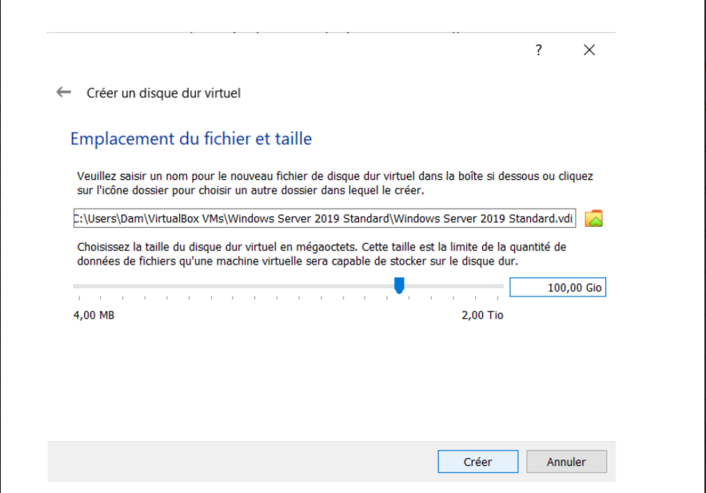

# **1- Presentation-Installation**

## **Présentation :**

Microsoft Windows Server est le système d'exploitation serveur de Microsoft, dérivé de la version grand
public de Windows. Conçu pour simplifier la gestion des services applicatifs et réseau, Windows Server
est segmenté en différentes familles depuis Windows 1.0 en 1985, qui a introduit l'interface graphique
de fenêtres.

Au fil des années, l'évolution de Windows Server a été influencée par la nécessité de concurrencer les
systèmes serveur existants. La transition vers un système orienté services plutôt que bureautique a
débuté avec les versions NT dans les années 1990. En 2003, Windows Server 2003 a marqué un
tournant majeur, devenant largement adopté en entreprise.

Depuis, Microsoft a continué à développer de nouvelles versions de Windows Server pour répondre aux
besoins changeants des entreprises, notamment les versions 2008, 2012, 2016, 2019 et 2022, offrant
ainsi une gamme complète de fonctionnalités pour les environnements serveur.

La version 2022 est sortie en été 2021. Cependant, comme les nouvelles versions sont généralement
suivies par beaucoup de correctifs, et qu'il n'est pas encore totalement déployé dans les entreprises, il
est plus sage pour le moment de rester sur la version 2019.

# **Les différentes éditions de Windows Server :**

Windows Server 2019 se décline en trois éditions, chacune ciblant des besoins spécifiques :

## **Windows Server 2019 Essentials :**

 - Destinée aux petites entreprises et organisations jusqu'à 25 utilisateurs et 50 équipements.

 - Coût d'environ 500 €.

 - Permet de faire fonctionner tous les services nécessaires à moindre coût.

 - Convient pour des besoins limités, mais au-delà de 25 utilisateurs, une mise à niveau vers une
édition Standard est nécessaire.

## **Windows Server 2019 Standard :**

 - Adaptée aux entités avec des besoins de virtualisation limités ou une faible densité de serveurs.

 - La tarification est basée sur le nombre de cœurs sur le serveur physique (environ 900 €).

 - Nécessite l'acquisition de licences d'accès clients en plus des licences Windows Pro pour les
postes de travail.

## **Windows Server 2019 Datacenter :**

 - Édition haut de gamme permettant la création illimitée de machines virtuelles sous Windows
Server.

 - Destinée aux entités ayant des besoins importants de virtualisation pour des centres de
données totalement gérés logiciellement.

 - La tarification est basée sur le nombre de cœurs des serveurs physiques (environ 6 500 €).

 - Requiert également une licence d'accès client pour chaque machine cliente, en plus d'une
licence Windows Pro.

 - La tarification peut être complexe en raison des différents packs proposés par les revendeurs.

Chaque édition est conçue pour répondre à des exigences spécifiques, offrant ainsi une flexibilité en
fonction des besoins et des ressources disponibles.

## **Prise en main de Windows Server Standard :**

## **Mise en Œuvre d'un Serveur Windows Standard pour TAI S.A.**

**Objectif** : Mise en place d'un Active Directory pour la gestion des identités et des droits d'accès.
Configuration d'un serveur de fichiers.

## **Choix du Système :**

Ayant plus de 25 utilisateurs et 50 équipements à gérer, la décision d'opter pour Windows Server 2019
Standard a été prise pour répondre aux besoins de TAI S.A.

## **Démarche :**

## **1. Téléchargement de l'ISO :**

 - Accéder au site officiel de Microsoft pour récupérer l'image ISO de Windows Server 2019
Standard.

## **2. Installation sur Machine Virtuelle (VM) :**

 - Utiliser un environnement de virtualisation tel que VirtualBox.

 - Créer une nouvelle VM et monter l'ISO pour installer Windows Server 2019 Standard.

## **3. Configuration Initiale :**

 - Suivre les étapes d'installation en spécifiant les paramètres nécessaires (langue, heure, clavier,
etc.).

## **4. Rôles et Fonctionnalités :**

 - Installer les rôles nécessaires. Pour l'Active Directory :

 - Accéder au Gestionnaire de Serveur.

 - Ajouter les rôles Active Directory Domain Services.

 - Suivre l'Assistant pour la configuration du domaine.

## **5. Configuration de l'Active Directory :**

 - Promouvoir le serveur en contrôleur de domaine.

 - Configurer le domaine, le nom NetBIOS, et le niveau fonctionnel du domaine.

## **6. Gestion des Utilisateurs et des Groupes :**

 - Utiliser la Console Utilisateurs et Ordinateurs Active Directory pour créer des utilisateurs et des
groupes.

## **7. Configuration du Serveur de Fichiers :**

 - Accéder au Gestionnaire de Serveur.

 - Ajouter le rôle de Serveur de Fichiers.

 - Configurer les partages et les autorisations d'accès.

## **8. Test et Qualification :**

 - Effectuer des tests pour s'assurer que l'Active Directory fonctionne correctement.

 - Vérifier l'accès au serveur de fichiers depuis les postes de travail.

## **Remarques :**

 - L'utilisation d'une version d'évaluation permet de tester la solution avant de procéder à un
déploiement complet.

 - La virtualisation offre un environnement isolé pour les tests.

 - Cette démarche assure une mise en place progressive et teste la configuration avant de la déployer
à grande échelle.

## **Téléchargement et Préparation de l'ISO de Windows Server 2019**

**Objectif :** Obtenir l'image ISO de Windows Server 2019 Standard depuis le site de Microsoft.

**Étapes :**

## **1. Accéder au Site Officiel :**

 - Ouvrir un navigateur web et accéder au site officiel de Microsoft : ISO de Windows Server 2019
Standard.

## **2. Navigation vers les Produits Serveur :**

 - Naviguer vers la section des produits serveur ou serveurs et cloud, généralement sous l'onglet
"Produits".

## **3. Sélection de Windows Server 2019 :**

 - Rechercher et sélectionner Windows Server 2019 dans la liste des produits disponibles.

## **4. Choix de l'Édition :**

 - Choisir l'édition appropriée, dans ce cas, Windows Server 2019 Standard.

## **5. Sélection du Format de Téléchargement :**

 - Opter pour le format d'image ISO pour faciliter l'installation sur une machine virtuelle.

## **6. Formulaire de Contact (le cas échéant) :**

- Remplir le formulaire de contact si nécessaire, en veillant à utiliser une adresse e-mail valide.

## **7. Validation et Téléchargement :**

 - Valider les informations fournies.

 - Procéder au téléchargement de l'ISO en cliquant sur le bouton dédié.

## **8. Enregistrement de la Clé Produit (le cas échéant) :**

 - Si une clé produit est nécessaire, elle peut être fournie à ce stade ou lors de l'installation.

## **9. Vérification de l'Intégrité de l'ISO (Optionnel) :**

 - Avant l'installation, il est recommandé de vérifier l'intégrité de l'ISO en comparant la somme de
contrôle fournie par Microsoft.

## **Remarques :**

 - Le formulaire de contact peut être nécessaire pour des raisons de suivi ou de collecte de données
marketing.

 - Une connexion Internet stable est essentielle pour un téléchargement sans interruption.

 - Le téléchargement de l'ISO depuis le site de Microsoft assure l'obtention d'une copie authentique et
à jour de Windows Server 2019 Standard.

---

# **Choix de la Version Française de Windows Server 2019**

## **Objectif :**

 - Sélectionner et télécharger la version française de l'image ISO de Windows Server 2019 Standard.

## **Étapes :**

## **1. Accès à la Page de Téléchargement :**

 -Après avoir validé les informations et options, vous serez redirigé vers la page de
téléchargement.

## **2. Langue et Édition :**

 - Assurez-vous que la langue sélectionnée est le français.
 - Vérifiez également que l'édition choisie est Windows Server 2019 Standard.
## **3. Téléchargement de l'ISO en Français :**

 - Si la langue est correcte, procédez au téléchargement de l'ISO en cliquant sur le lien ou le
bouton dédié.

## **4. Attente du Téléchargement :**

 - Attendez que le téléchargement soit complet. La durée dépend de la vitesse de votre connexion
Internet.

## **5. Vérification de l'Intégrité (Optionnel) :**

 -En option, vérifiez l'intégrité de l'ISO en comparant la somme de contrôle fournie par Microsoft.

## **Remarques :**

 - Il est crucial de choisir la langue désirée pour garantir une expérience utilisateur dans la langue
souhaitée pendant l'installation et l'utilisation de Windows Server 2019 Standard.

 - L'ISO téléchargé devrait être stocké dans un emplacement facilement accessible pour l'installation
ultérieure sur une machine virtuelle.

 - En suivant ces étapes, vous vous assurez d'obtenir la version française de Windows Server 2019
Standard pour votre environnement de test sous VirtualBox.

---

# **Installation de Windows Server 2019 Standard sur une Machine Virtuelle**

## **Objectif :**

 - Installer Windows Server 2019 Standard sur une machine virtuelle à l'aide de VirtualBox.

## **Étapes :**

## **1. Nom de la Machine Virtuelle :**

 - Choisissez "Nouvelle" et entrez le nom de votre système : "Windows Server 2019 Standard".

 - Cela sélectionnera automatiquement le type "Microsoft Windows" et la version "Windows 2019
(64 bits)".

---

## **Étapes :**

## **2. Allocation de Mémoire Vive :**

 - Affectez une quantité de mémoire vive à la machine virtuelle. Pour commencer, restez sur 2048
Mio.

---

## **Étapes :**

## **3. Configuration du Disque Dur Virtuel :**

 - Spécifiez l'espace de stockage (disque dur) pour la machine virtuelle. Vous pouvez choisir de
créer un disque dynamiquement alloué et définir une taille suffisante, par exemple, 100 Gio.

---